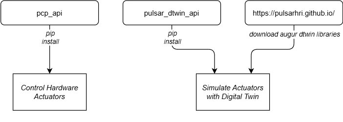

# Home
Welcome to the Pulsar documentation wiki! This wiki contains everything you need to begin working with the Pulsar Actuators or Pulsar Motors. Whether you're a researcher, developer, or engineer, this guide will walk you through setting up your environment, installing the packages, and accessing the documentation and examples.

The Pulsar packages is designed to provide a robust and flexible interface for controlling and monitoring Pulsar hardware. It includes:

* A Python package for controlling the real hardware
* A Python package for controlling the digital twin (AUGUR)
* Example scripts for common use cases
* Detailed descriptions of available classes, methods, and parameters
* Best practices for integration and deployment

## Overview of the Pulsar ecosystem

PULSAR HRI develops best-in-class actuation systems to enable future robotic capabilities. Our goal is to providing the absolute best performance in motors and actuators, defining performance with novel metrics including agility, torque and efficiency. Our design principle is fully model driven, that is why we are able to provide high perfromance actuators together with high fidelity digital twins (AUGUR) of them. In this wiki you will find all the necessary material to set up either a simulation or a real setup with our motors.

