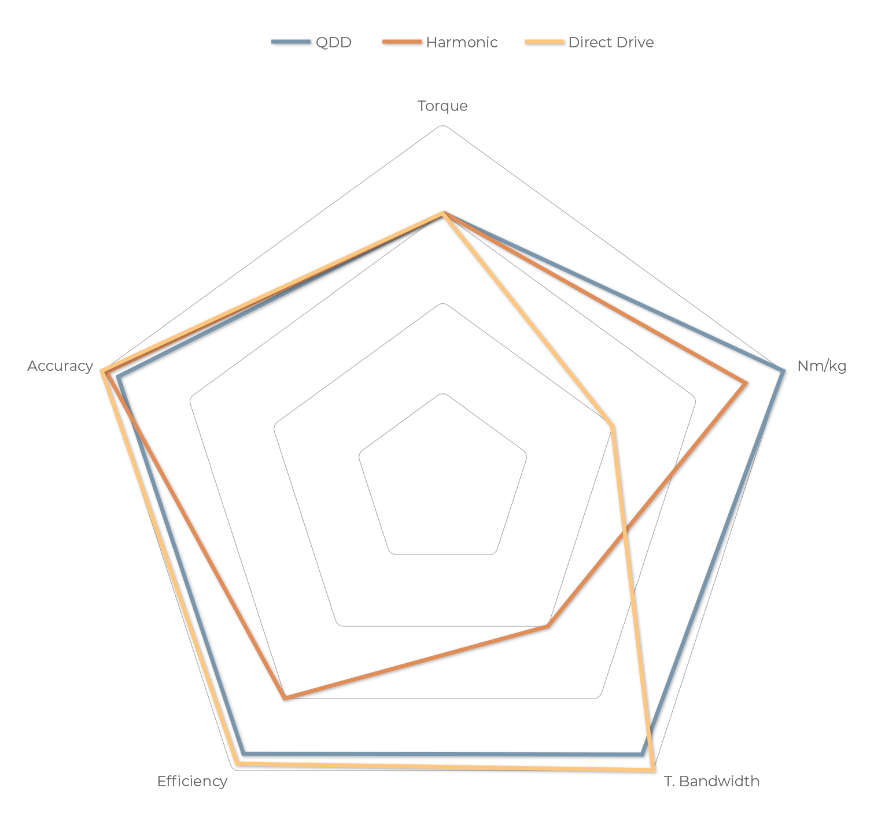

# Context of Pulsar hardware actuator family and use cases

Robotic applications require motors and actuators which can produce high torques at low speeds, while being able to change speed and torque in a reliable and agile manner. A key performance indicator often overlooked is dynamic efficiency, a critical requirement for mobile robots. 

## Motors

We provide our motors both on frameless and framed configurations. Your motor, your choice. Our range covers different sizes and torques to fit multiple applications, all of them delivering superb dynamic response (bandwidth) and torque density, while requiring low current to drive them. Both second electrical generation motors and custom design services can be unlocked by joining our Vanguard Program.​ All our motors can be spiced up with Hall and Temperature sensors.

## Actuators

We design Quasi-Direct Drive (QQD) actuators offer a well-balanced alternative to traditional high-gear solutions, and a more effective solution compared to direct drive.

Design specifics also matter. Therefore, we decided to design our transmissions with a very low gear ratio to increase the total bandwidth, boost backdrivability, improve proprioceptiveness and better respond to highly-dynamic intermittent operations.

