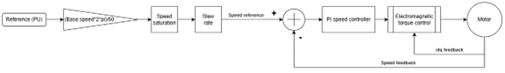

# Control modes overview

## Overview of Operation Modes

Before initiating any actuator movement, it is essential to configure the appropriate control mode. The selected mode determines how the actuator interprets and responds to setpoints. Once a control mode is active, the system will establish the corresponding setpoint based on the mode’s logic and parameters.

## Standard Control Modes

The actuator supports several core control strategies, each optimized for specific performance characteristics:

### Electromagnetic Torque Control

This mode directly controls the torque output of the actuator by regulating the motor current. It includes three predefined profiles, each offering a different control bandwidth—from conservative to aggressive—tailored for various application needs.

### Speed Control

Speed control is implemented using a dual-loop architecture:

- The inner loop manages torque via current control.
- The outer loop regulates speed using a Proportional-Integral (PI) controller.

Users can either manually tune the PI parameters or select from optimized preset profiles.

### Position Control

Position control is achieved through a hierarchical control structure:

- A proportional controller governs the position loop.
- This loop operates over the speed and torque control layers, ensuring smooth and accurate positioning.

### Impedance Control (Under development)

!!! warning
    DO NOT USE THIS MODE AS IT IS UNDER DEVELOPMENT

This advanced mode simulates mechanical impedance (stiffness and damping) by manipulating motor currents at a low level. It is particularly useful for applications requiring compliant or human-interactive behavior. 

## Special-Purpose Modes

!!! warning
    DO NOT USE THESE MODES UNLESS SPECIFIED BY PULSAR DEVELOPMENT TEAM

In addition to the standard modes, the actuator includes several specialized modes designed for debugging, testing, and system integration. These are not intended for regular operation but are invaluable during development and troubleshooting:

### Startup Calibration Mode

The actuator includes an internal calibration routine that can be triggered directly. During calibration, the system performs offset calibration for both current sensing and position measurement—aligning the motor’s electrical position with the mechanical position of the encoder. As part of this process, the relative position (turn count) is reset to zero.

During this calibration:

- The relative position (also known as the "turn count") is reset to zero.
- **Note:** This does not affect the absolute position. To reset the absolute position, the `Set Zero Position` command must be used separately.

### Fixed Voltage Injection (FVI)

Injects a constant DC voltage into the motor phases. Useful for basic motor testing and diagnostics.

### Open-Loop Mode

Applies a rotating voltage vector to the motor using a V/f (voltage-to-frequency) control method. This mode typically runs at a constant speed or can be configured with user-defined parameters.

### Direct Voltage Injection (DVI)

Allows manual control of the voltage vector applied to the motor phases. The internal encoder is used to orient the voltage field, enabling precise testing of motor response.

