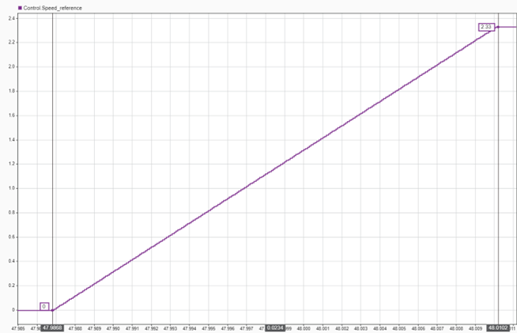

# Actuator parameters

In this section we will show the different parameters that are available in an actuator and their description, see [Table – PCP_Parameters Enum](#table-pcp_parameters-enum). Moreover, the functions to [read](#reading-actuator-parameters) and [change](#modifying-actuator-parameters) them will be presented. The use of [setpoint profiles and how to set limits to the actuator](#use-of-profiles-and-limits) is also included here.

## Table – PCP_Parameters Enum

| Enum Name                | Code   | Description |
|--------------------------|--------|-------------|
| `K_DAMPING`              | 0x01   | Damping coefficient (Nm·s/rad) for the virtual damper behavior (Impedance Control) |
| `K_STIFFNESS`            | 0x02   | Stiffness coefficient (Nm/rad) for the virtual spring behavior (Impedance Control) |
| `TORQUE_FF`              | 0x03   | Feedforward Torque Value (Nm) |
| `LIM_TORQUE`             | 0x04   | Upper and lower bounds for how much torque can be applied in the positive and negative directions. (Nm) |
| `LIM_POSITION_MAX`       | 0x05   | Max. Position Limit (rad) |
| `LIM_POSITION_MIN`       | 0x06   | Min. Position Limit (rad) |
| `LIM_SPEED_MAX`          | 0x07   | Max. Speed Limit (rad/s) |
| `LIM_SPEED_MIN`          | 0x08   | Min. Speed Limit (rad/s) |
| `PROFILE_POSITION_MAX`   | 0x09   | Max. Positive Speed (rad/s) in Position control configuration |
| `PROFILE_POSITION_MIN`   | 0x0A   | Min. Negative Speed (rad/s) in Position control configuration |
| `PROFILE_SPEED_MAX`      | 0x0B   | Max. Acceleration (rad/s^2) in Speed control configuration |
| `PROFILE_SPEED_MIN`      | 0x0C   | Max. Deceleration (rad/s^2) in Speed control configuration |
| `KP_SPEED`               | 0x0D   | Kp speed control constant P value |
| `KI_SPEED`               | 0x0E   | Ki speed control constant I value |
| `KP_POSITION`            | 0x0F   | Kp position control constant P value |
| `MODE`                   | 0x30   | Operation Mode (read-only, must be set via `CHANGE_MODE`) |
| `SETPOINT`               | 0x31   | Setpoint, Position (rad), Speed (rad/s), Torque (Nm) |
| `FIRMWARE_VERSION`       | 0x80   | Firmware version |

---

## Reading Actuator Parameters

### `get_parameters_all()`

Retrieve all configuration parameters of the actuator at once.

**Returns**:
- `dict`: A dictionary containing all parameters and their values.

### `get_parameters(parameters, timeout=1.0)`

Retrieve specific parameters from the actuator.

**Parameters**:
- `parameters` (list): A list of parameters to request (see [Table – PCP_Parameters Enum](#table-pcp_parameters-enum)).
- `timeout` (float, optional): Maximum time to wait for a response, in seconds. Default is `1.0`.

**Returns**:
- `dict`: A dictionary containing the requested parameters and their values.

---

## Modifying Actuator Parameters

### `set_parameters(parameters)`

Modify specific parameters of the actuator.

**Parameters**:
- `parameters` (dict): A dictionary with `PCP_Parameters` enums as keys and their corresponding values.

!!! warning
    Ensure that the parameters you modify are within the valid range and do not conflict with other settings to avoid improper actuator behavior.
---

## Use of profiles and limits

The use of position, speed or torque limits apply a saturation to the input reference of the corresponding control.

The profile options provide the posibility of doing trapezoidal reference changes. Below there are some examples.

- Setting the Max positive speed $(rad/s)$ to 5 $rad/s$ and using the position control.

$$
\text{Speed (rad/s)} = \frac{0.5 \cdot 2 \cdot \pi}{0.630} = 5 \, \text{(rad/s)}
$$

- Setting the Max acceleration $(rad/s^2)$ to 100 $rad/s^2$ and using the speed control.

$$
\text{Acceleration }(rad/s^2) = \frac{2.33}{0.0234} = 100 \, (rad/s^2)
$$