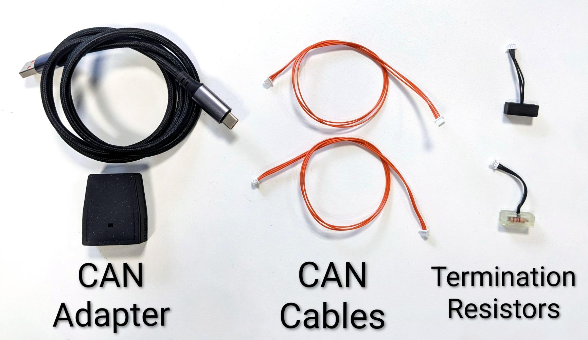
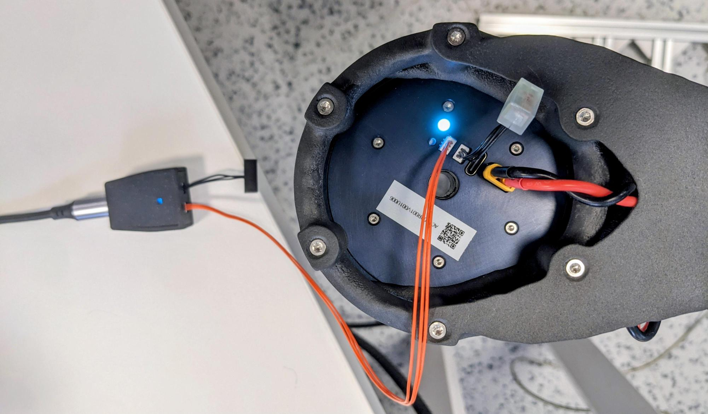

# Communicate with Real Actuators

This page guides you through the available communication methods with a real PULSAR actuator.

Currently, there are two supported modes of communication:

1. **USB**: Direct connection to a single actuator using a USB-C cable.
2. **CAN** (via USB-to-CAN adapter): Used for connecting one or multiple actuators on a CAN bus.

<p align="center">
  
</p>

---

## USB Communication

This is the most straightforward method for connecting a single actuator during development or testing.

!!! warning
    Before continuing, ensure that your actuator is securely mounted and powered on, as explained in the [Set Up Real Actuators](../set_up/set_up_real.md) guide.


### 1. Connect USB

Use a USB-A to USB-C cable to connect the actuator directly to your computer.

> 💡 The actuator will switch LED color when USB is successfully connected.


### 2. Check USB Communication

To verify the connection either start up the [PULSAR Desktop App](../control/desktop_app/desktop_app.md), or use the [Python API CLI tool](../control/python_api/cli.md).

You should see your actuator listed.

---

## CAN Communication

By connecting actuators on the same CAN bus, you can control one or multiple actuators together. Communication is enabled through a CAN adapter device.

The steps below guide you through connecting a **single actuator via CAN**. The same procedure can then be extended to multiple actuators.

!!! warning
    Before continuing, ensure your actuator is securely mounted and powered on, as explained in the [Set Up Real Actuators](../set_up/set_up_real.md) guide.

---

### 1. Prepare the Hardware

To connect one actuator on a [CAN network](../set_up/hardware_interfaces/electrical_interfaces.md#can-bus), you will need:

* [**1× CAN adapter**](../set_up/hardware_interfaces/electrical_interfaces.md#can-communication-adapter) – we recommend the PULSAR USB-to-CAN adapter (two CAN ports).
* **1× USB-A to USB-C cable** – to connect the adapter to your computer.
* [**1× CAN bus cable**](../set_up/hardware_interfaces/electrical_interfaces.md#can-bus-cables) – 3‑pin Molex PicoBlade cable.
* [**2× Termination resistors (TR)**](../set_up/hardware_interfaces/electrical_interfaces.md#can-bus-termination-resistors-tr) – 120 Ω, one at each end of the bus.



!!! note
    CAN ports are **bidirectional**: there is no distinction between *input* or *output*. On both actuators and the CAN adapter, either port can be used.

---

### 2. Physically Connect the Hardware

1. Connect the CAN adapter to your computer using a USB‑A to USB‑C cable. The adapter LED should light up.
2. Plug one termination resistor into one CAN port of the adapter.
3. Plug a CAN cable into the other CAN port of the adapter.
4. Connect the other end of the CAN cable to a CAN port of the actuator.
5. Insert the second termination resistor into the remaining CAN port of the actuator.

Your setup should now look like this:



---

### 3. Connect via CAN

To communicate via CAN using the [Python API](../control/python_api/install_python_api.md) or the [Desktop App](../control/desktop_app/desktop_app.md), you will need the **CAN address** of the actuator.

* Each actuator has a unique integer CAN address stored in its firmware.
* The address is automatically included in CAN messages so that each actuator knows which messages to respond to.

To discover the address, use the [Command Line Interface tool](../control/python_api/cli.md) that comes with the Python API:

```bash
pulsar-cli scan
```

!!! note
    The output of this command lists the actuator addresses detected on the CAN bus.

    Example output:

    ```
    Connecting to CAN adapter on port /dev/ttyACM0 ...
    Scanning addresses from 0x10 to 0xFF ... (CTRL+C to cancel)
    Device found: address 0x1D (29) model PULSE98_V1   firmware version 21
    Found 1 addresses: [29]
    ```

---

### 4. Troubleshooting

#### CAN Adapter Issues

If the CLI output shows:

```
No serial ports found
Serial port not connected
Found 0 addresses: []
```

This means the CAN adapter is not detected.

Check the following:

* Ensure the adapter is plugged in and the LED is on.
* Try unplugging and replugging the USB cable.
* Try a different USB port on your computer.
* Try a different USB cable.
* If the problem persists, [contact support](../support.md).

#### CAN Bus Issues

If the CLI output shows:

```
Connecting to CAN adapter on port /dev/ttyACM0 ...
Scanning addresses from 0x10 to 0xFF ... (CTRL+C to cancel)
Found 0 addresses: []
```

This means the adapter is connected, but no actuator is found.

Check the following:

* Ensure the actuator is powered on.
* Verify all cables and termination resistors are properly connected.
* Try replacing the CAN cable.
* Try replugging the CAN adapter.
* If the problem persists, [contact support](../support.md).

---

### 5. Connecting Multiple Actuators

To add more actuators:

* Daisy‑chain additional CAN cables between actuators.
* Place termination resistors only at the **two ends** of the bus.

Example CLI scan output with two actuators:

```
Connecting to CAN adapter on port /dev/ttyACM0 ...
Scanning addresses from 0x10 to 0xFF ... (CTRL+C to cancel)
Device found: address 0x1D (29) model PULSE98_V1   firmware version 21
Device found: address 0x25 (37) model PULSE98_V1   firmware version 21
Found 2 addresses: [29, 37]
```

---

### 6. Bus Topologies

The CAN adapter can be placed:

* **At the start of the chain** – all actuators connected in series (common in robotic arms).
* **In the middle of the chain** – two actuator chains branching out (common in quadrupeds or humanoids).

Both setups require termination resistors at the two physical ends of the bus. 

---

### 7. Multiple CAN Buses

It is possible to use multiple CAN adapters on the same computer, each creating an independent CAN bus. This is useful for complex robots.

Example:

* **Upper limbs** – one CAN adapter in the torso connects to the arm actuators.
* **Lower limbs** – another CAN adapter in the torso connects to the leg actuators.

This allows parallel, modular control of different parts of the system.


---

!!! success
    You can now connect to the actuator(s)!! You can now interact with the actuator either using:

    * The [PULSAR HRI Desktop App as per this tutorial](../quickstarts/quickstart_desktop_app.md)
    * The [Python API as per this other tutorial](../quickstarts/quickstart_python_api.md)

!!! question
    Need help or something doesn’t work? Head over to the [Support page](../support.md): we’ve got your back.
