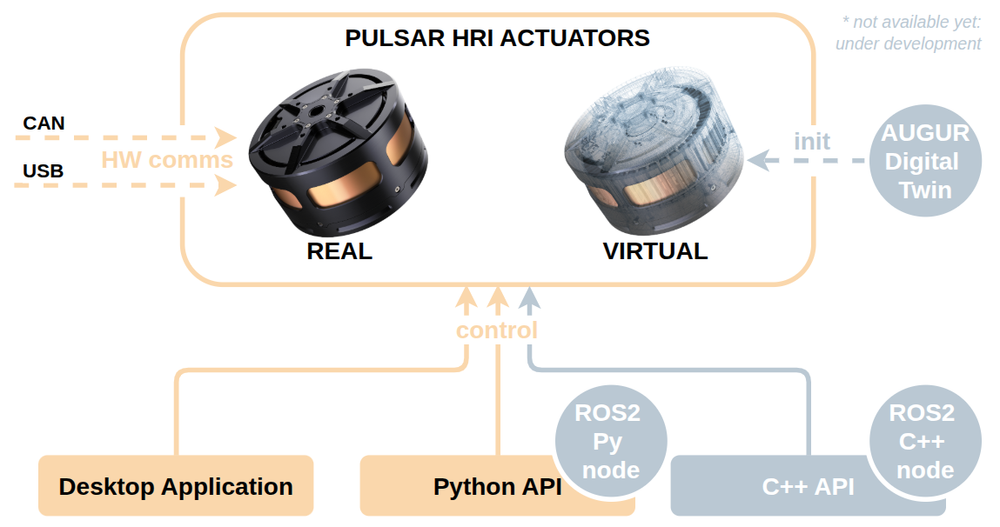

# Communicate with Real Actuators

This page guides you through the available communication methods with a real PULSAR actuator.

Currently, there are two supported modes of communication:

1. **USB**: Direct connection to a single actuator using a USB-C cable.
2. **CAN** (via USB-to-CAN adapter): Used for connecting one or multiple actuators on a CAN bus.

!!! warning
    Before continuing, ensure that your actuator is securely mounted and powered on, as explained in the [Set Up Real Actuators](../set_up/set_up_real.md) guide.

---

## USB Communication

This is the most straightforward method for connecting a single actuator during development or testing.

### 1. Connect USB

Use a USB-A to USB-C cable to connect the actuator directly to your computer.

> 💡 The actuator will switch LED color when USB is successfully connected.

### 2. Check USB Communication

To verify the connection either start up the [PULSAR Desktop App](../control/desktop_app/desktop_app.md), or use the [Python API CLI tool](../control/python_api/cli.md).

You should see your actuator listed.

---

## CAN Communication

Step by step guide coming soon.. [for now see here](../set_up/hardware_interfaces/electrical_interfaces.md)

---

!!! success
    You are connected!! You can now interact with the actuator either using:

    * The [PULSAR HRI Desktop App as per this tutorial](../quickstarts/quickstart_desktop_app.md)
    * The [Python API as per this other tutorial](../quickstarts/quickstart_python_api.md)

!!! question
    Need help or something doesn’t work? Head over to the [Support page](../support.md): we’ve got your back.
