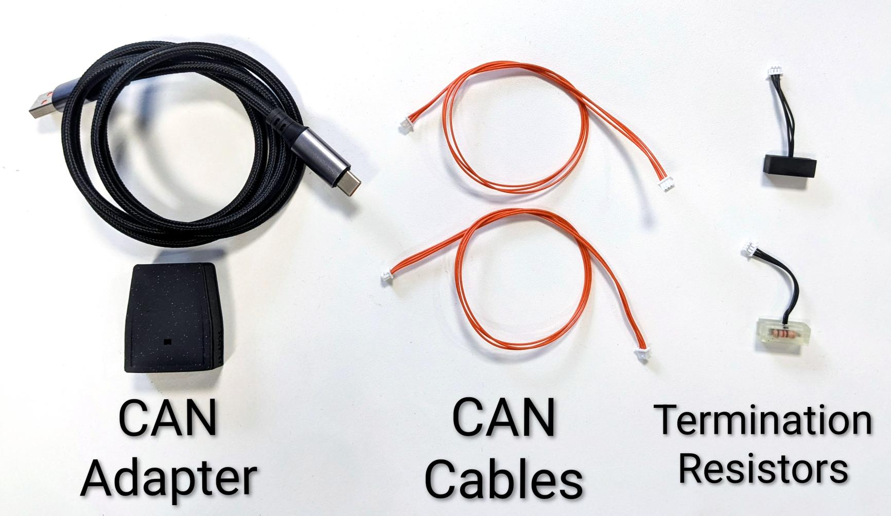
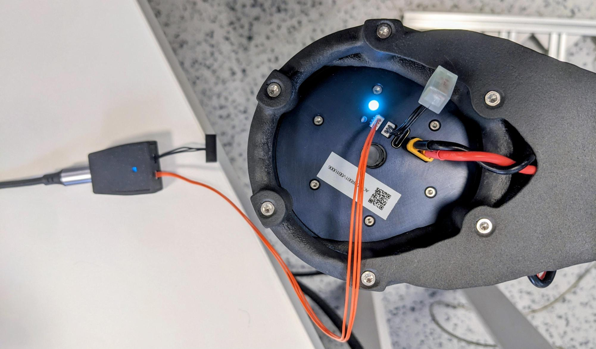

# CAN Communication

CAN FD allows you to control one or more PULSAR actuators on the same bus through a CAN adapter. PULSAR actuators support selectable data rates of **1 Mbps** and **5 Mbps**. Reliable high-speed or multi-actuator operation depends on correct wiring, termination, topology, cable quality, and host-side load.

!!! warning "Safety"
    Before connecting or commanding a real actuator, ensure it is securely mounted and powered on as described in [Set Up Real Actuators](../../../set_up/set_up_real.md).

!!! note "Feedback bandwidth"
    Treat `PCP_Items` as a selection menu rather than a recommendation to enable every channel. Start with only the signals needed for your test. For high-rate or multi-actuator runs, begin with three or four feedback items and increase gradually only if samples remain stable. See the [Python API code reference](../../../control/python_api/class_PulsarActuatorReal.md#pcp_api.pulsar_actuator_real.PulsarActuatorReal.PCP_Items) for the available items.

## 1. Prepare the hardware

For connector, pinout, cable, and termination details, see the [Electrical Interfaces](../../../set_up/hardware_interfaces/electrical_interfaces.md) reference.

For a single-actuator CAN network, you need:

- [A CAN adapter](../../../set_up/hardware_interfaces/electrical_interfaces.md#can-communication-adapter), such as the PULSAR USB-to-CAN adapter.
- A USB-A to USB-C cable for the adapter.
- [A 3-pin Molex PicoBlade CAN bus cable](../../../set_up/hardware_interfaces/electrical_interfaces.md#can-bus-cables).
- [Two 120 Ω termination resistors](../../../set_up/hardware_interfaces/electrical_interfaces.md#can-bus-termination-resistors-tr), one at each end of the bus.



!!! note
    CAN ports are bidirectional. Either port can be used on an actuator or on the CAN adapter.

## 2. Wire the bus

1. Connect the CAN adapter to your computer with a USB-A to USB-C cable. Its LED should light up.
2. Connect one termination resistor to one CAN adapter port.
3. Connect the CAN cable to the adapter's other port and to a CAN port on the actuator.
4. Connect the second termination resistor to the actuator's remaining CAN port.



Both termination resistors must be at the two physical ends of the bus.

## 3. Discover the actuator address

Each actuator has a unique integer CAN address stored in firmware. Use the [Python API CLI tool](../../../control/python_api/cli.md) to scan the bus:

```bash
pulsar-cli scan
```

Example output:

```text
Connecting to CAN adapter on port /dev/ttyACM0 ...
Scanning addresses from 0x10 to 0xFF ... (CTRL+C to cancel)
Device found: address 0x1D (29) model PULSE98_V1   firmware version 21
Found 1 addresses: [29]
```

Once the address is known, connect with the [Python API](../../../control/python_api/install_python_api.md) or [PULSAR App GUI](../../../control/pulsar_app/pulsar_app.md).

## Troubleshooting

### CAN adapter not detected

If the scan reports `No serial ports found`, `Serial port not connected`, or `Found 0 addresses: []` immediately, check that:

- The adapter is plugged in and its LED is on.
- You have tried reconnecting the USB cable or using another USB port or cable.
- You have [contacted support](../../../support.md) if the problem persists.

### No actuator found

If the adapter is detected but the scan reports `Found 0 addresses: []`, check that:

- The actuator is powered on.
- All CAN cables and termination resistors are correctly connected.
- You have tried replacing the CAN cable and reconnecting the adapter.
- You have [contacted support](../../../support.md) if the problem persists.

## Multiple actuators

To add actuators, daisy-chain CAN cables between them. Keep termination resistors only at the two physical ends of the bus. A scan should report each actuator with its distinct address, for example:

```text
Device found: address 0x1D (29) model PULSE98_V1   firmware version 21
Device found: address 0x25 (37) model PULSE98_V1   firmware version 21
Found 2 addresses: [29, 37]
```

## Bus topologies

The CAN adapter can be placed at the start of the actuator chain or in the middle, with actuator chains branching in two directions. Both arrangements require termination at the two physical ends of the bus.

## Multiple CAN buses

Multiple CAN adapters can be used on one computer, with each adapter creating an independent bus. For example, one bus can serve the upper limbs and another can serve the lower limbs, enabling parallel and modular control.

## Plan bus capacity

Use the [CAN Bus Utilization Tool](bus_utilization.md) to estimate theoretical CAN FD load before selecting actuator counts, feedback rates, command rates, and bus data rates.

## Continue to control

- [PULSAR App GUI quickstart](../../../quickstarts/quickstart_pulsar_app.md)
- [Python API quickstart](../../../quickstarts/quickstart_python_api.md)
- [Electrical interface reference](../../../set_up/hardware_interfaces/electrical_interfaces.md)
