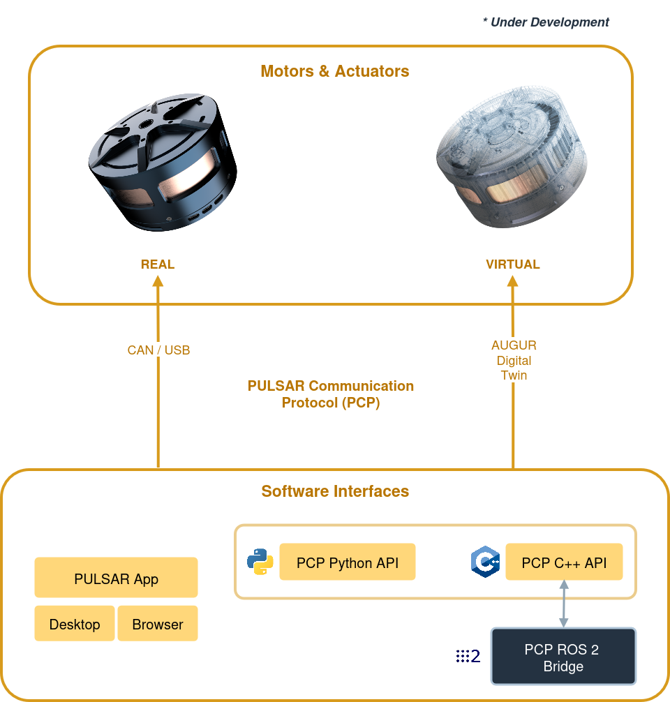
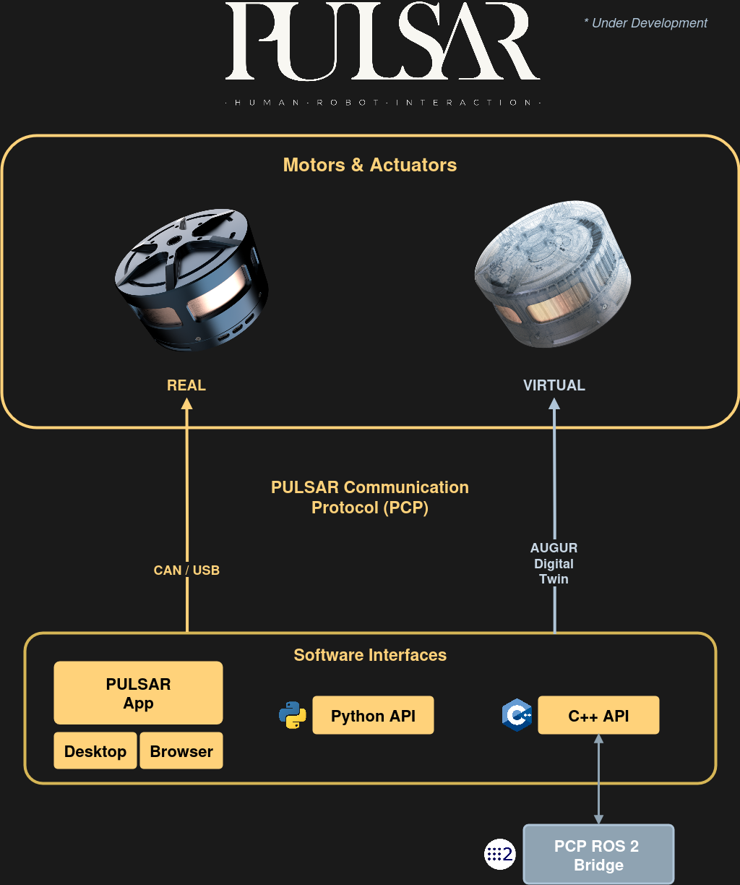

# Communicate with Real Actuators

Choose the communication method that fits your PULSAR actuator workflow:

- [USB Communication](usb.md) — connect directly to one actuator for development, testing, and firmware updates.
- [CAN Communication](can/index.md) — connect one or more actuators through a CAN FD bus.
- [EtherCAT](ethercat.md) — support is in progress; it is not currently available for customer use.

!!! warning "Safety"
    Before connecting or commanding a real actuator, ensure it is securely mounted and powered on as described in [Set Up Real Actuators](../../set_up/set_up_real.md).

  
  

