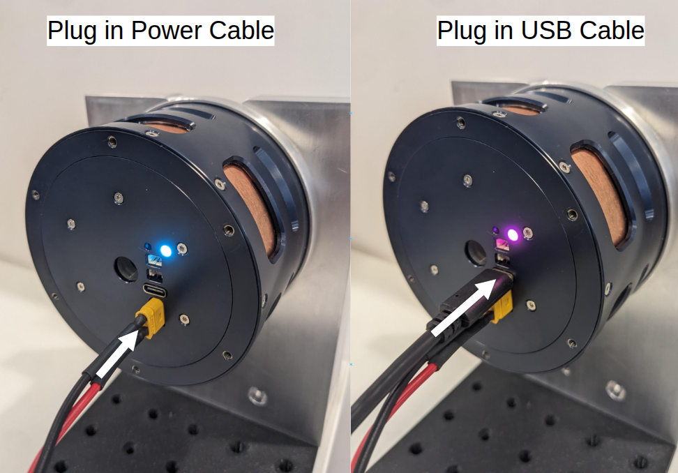

# USB Communication

USB is the most straightforward way to connect a single PULSAR actuator during development or testing.

!!! warning "Safety"
    Before connecting or commanding a real actuator, ensure it is securely mounted and powered on as described in [Set Up Real Actuators](../../set_up/set_up_real.md).

## Connect the actuator

1. Use a USB-A to USB-C cable to connect the actuator directly to your computer.
2. Confirm that the actuator LED changes color when the USB connection is established.

## Verify communication

Open the [PULSAR App GUI](../../control/pulsar_app/pulsar_app.md), or use the [Python API CLI tool](../../control/python_api/cli.md), and confirm that your actuator is listed.

For the fastest complete setup, follow the [USB setup quickstart](../../quickstarts/quickstart_set_up_usb.md). You can also continue with the [Python API quickstart](../../quickstarts/quickstart_python_api.md).
