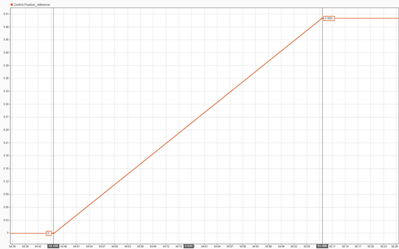

# Actuator parameters

In this section we will show the different parameters that are available in an actuator and their description, see [Table – PCP_Parameters Enum](#table-pcp_parameters-enum). Moreover, the functions to [read](#reading-actuator-parameters) and [change](#modifying-actuator-parameters) them will be presented. The use of [setpoint profiles and how to set limits to the actuator](#use-of-profiles-and-limits) is also included here.

## Use of profiles and limits

The use of position, speed or torque limits apply a saturation to the input reference of the corresponding control.

The profile options provide the posibility of doing trapezoidal reference changes. Below there are some examples.

- Setting the Max positive speed $(rad/s)$ to 5 $rad/s$ and using the position control.

$$
\text{Speed (rad/s)} = \frac{0.5 \cdot 2 \cdot \pi}{0.630} = 5 \, \text{(rad/s)}
$$

- Setting the Max acceleration $(rad/s^2)$ to 100 $rad/s^2$ and using the speed control.

$$
\text{Acceleration }(rad/s^2) = \frac{2.33}{0.0234} = 100 \, (rad/s^2)
$$