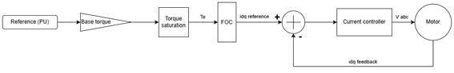
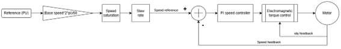
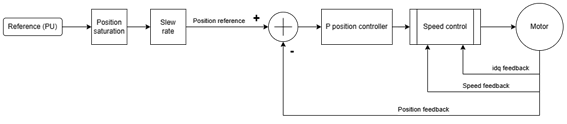
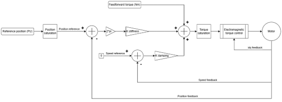
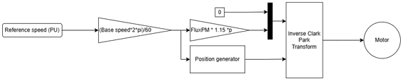
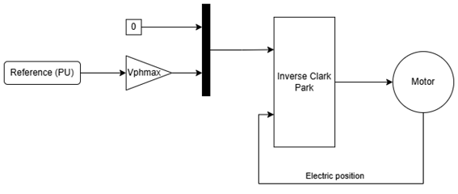

# Control Modes Overview

## Overview of Operating Modes

Before initiating any actuator movement, it is essential to select the appropriate control mode. The selected mode determines how the actuator interprets and responds to setpoints. Once a control mode is active, the system establishes the corresponding setpoint based on that mode’s logic and parameters.

## Standard Control Modes

The actuator supports several core control strategies, each optimized for specific performance characteristics.

### Electromagnetic Torque Control

This mode directly controls the torque output of the actuator by regulating the motor current. It includes three predefined profiles, each offering a different control bandwidth, from conservative to aggressive, tailored to different application needs.

### Speed Control

Speed control is implemented using a dual-loop architecture:

- The inner loop manages torque via current control.
- The outer loop regulates speed using a proportional-integral (PI) controller.

Users can either tune the PI parameters manually or select from optimized preset profiles.

### Position Control

Position control is achieved through a hierarchical control structure:

- A proportional controller governs the position loop.
- This loop operates over the speed and torque control layers, ensuring smooth and accurate positioning.

### Impedance Control (*Under Development*)

!!! warning
    Do not use this mode, as it is still under development.

This advanced mode simulates mechanical impedance (stiffness and damping) by manipulating motor currents at a low level. It is particularly useful for applications that require compliant or human-interactive behavior.

## Special-Purpose Modes

!!! warning
    Do not use these modes unless instructed to do so by the PULSAR development team.

In addition to the standard modes, the actuator includes several specialized modes designed for debugging, testing, and system integration. These are not intended for regular operation, but they are invaluable during development and troubleshooting.

### Startup Calibration Mode

The actuator includes an internal calibration routine that can be triggered directly. During calibration, the system performs offset calibration for both current sensing and position measurement, aligning the motor’s electrical position with the encoder’s mechanical position.

During this calibration:

- The relative position (also known as the "turn count") is reset to zero.
- **Note:** This does not affect the absolute position. To reset the absolute position, use the `Set Zero Position` command separately.

### Fixed Voltage Injection (FVI)

This mode injects a constant DC voltage into the motor phases. It is useful for basic motor testing and diagnostics.

### Open-Loop Mode

This mode applies a rotating voltage vector to the motor using a V/f (voltage-to-frequency) control method. It typically runs at a constant speed or can be configured with user-defined parameters.

### Direct Voltage Injection (DVI)

This mode allows manual control of the voltage vector applied to the motor phases. The internal encoder is used to orient the voltage field, enabling precise testing of motor response.

