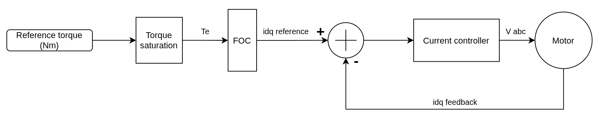
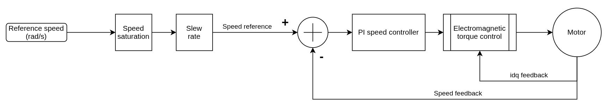
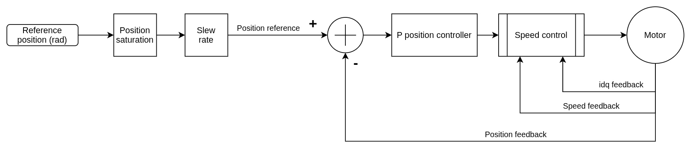
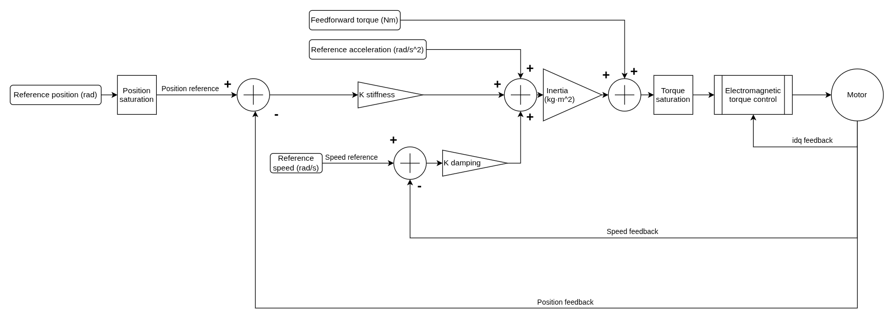

# Control Modes Overview

!!! note
    Control modes run at the lowest level in the same way on real actuator firmware and in the virtual AUGUR Digital Twin model. They are accessed through the available [software interfaces](../pulsar_app/pulsar_app.md), with API enum names and control type values currently shown using Python API 2.0.0 terminology.

## Overview of Operating Modes

Before initiating any actuator movement, it is essential to select the appropriate control mode. The selected mode determines how the actuator interprets and responds to setpoints. Once a control mode is active, the system establishes the corresponding setpoint based on that mode’s logic and parameters.

The available user-facing control modes are:

- **Electromagnetic torque control**: regulate output torque through the current loop.
- **Speed control**: regulate actuator speed through an outer speed loop.
- **Position control**: regulate actuator position through nested position, speed, and torque loops.
- **Impedance control**: regulate compliant behavior through virtual stiffness, damping, inertia, and torque terms.

For the parameters associated with each mode, see [Which Control Parameters Can Be Used in Each Mode?](control_modes_parameters.md). For runnable real and virtual actuator tutorials, follow the [Python API Examples](../python_api/examples.md); the examples repository includes dedicated notebooks for changing control modes and control parameters.

The diagrams below are simplified signal-flow diagrams. They show the main reference, saturation, controller, and feedback paths used by each mode; they do not include every firmware protection or diagnostic path.

## API Mode Names

| User-facing mode | Python API enum | Control type value |
| --- | --- | --- |
| Torque control | `Mode.TORQUE` | `5` |
| Speed control | `Mode.SPEED` | `6` |
| Position control | `Mode.POSITION` | `7` |
| Impedance control | `Mode.IMPEDANCE` | `8` |

## Control Modes

The actuator supports several control strategies, each optimized for specific performance characteristics.

### Electromagnetic Torque Control

This mode controls the actuator torque by converting a reference torque in Nm into field-oriented current references. The requested torque is first limited by the configured torque saturation, then the field-oriented control (FOC) block generates `idq` current references. The current controller closes the loop using `idq` feedback from the motor.

### Speed Control

Speed control is implemented using a dual-loop architecture:

- The inner loop is electromagnetic torque control, which closes the current loop.
- The outer loop regulates speed using a proportional-integral (PI) controller.

The reference speed is limited by the configured speed saturation and slew-rate limit before entering the speed controller. The PI speed controller uses speed feedback to generate the torque command sent to the inner torque-control loop.

### Position Control

Position control is achieved through a hierarchical control structure:

- A proportional controller governs the outer position loop.
- The position loop generates a speed request for the nested speed-control loop.
- The speed-control loop then uses the electromagnetic torque-control loop internally.

The reference position is limited by the configured position saturation and slew-rate limit before entering the position controller.

### Impedance Control

This mode computes a torque request from virtual stiffness, damping, and inertia terms. Position, speed, acceleration, and feedforward torque references are combined with position and speed feedback before torque saturation and the inner electromagnetic torque-control loop.

It is intended for compliant or human-interactive behavior and is available through both the real and virtual actuator Python APIs.

