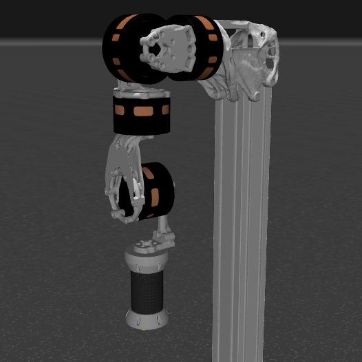

# Download Robot Model Assets

Robot model asset packages provide simulation models, meshes, textures, and trajectories used by robot-level examples in the PULSAR HRI Python examples repository.

## Single Link 1DOF

- Latest version: `20260530_1`
- Model: `single_link_1dof`
- Contents: MuJoCo XML scenes and STL meshes for the single-link DTwin robot tutorials, including payload sweep variants
- Manifest: [`robot_assets_manifest.json`](robot_assets_manifest.json)
- Archive: [`single-link-1dof-assets-20260530_1.zip`](robot_assets/single-link-1dof-assets-20260530_1.zip)

## Pulse Arm 4DOF

- Latest version: `20260529_1`
- Model: `pulse_arm_4dof`
- Contents: MuJoCo XML, STL meshes, carbon texture, and sample joint-space trajectories
- Manifest: [`robot_assets_manifest.json`](robot_assets_manifest.json)
- Archive: [`pulse-arm-4dof-assets-20260529_1.zip`](robot_assets/pulse-arm-4dof-assets-20260529_1.zip)

To install and use robot model assets with the Python API, follow the [Python API Examples](../control/python_api/examples.md) page. The examples repository README is the source of truth for setup, run commands, and the current robot asset installer workflow.

For support, [contact our team](../support.md).
