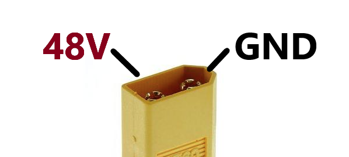

# Electrical Interfaces

## Power bus

The power bus requirements are:

- Voltage: 48V DC
- Current: up to 30A

Keep in mind that the actuators usually draw much less current (less than 1A without load), but you should still ensure that your power supply can provide the maximum current, or limit the current if the device is demanding more than the power supply can provide.

The device has a XT60 male connector for power input. The pinout is as follows:

## CAN bus

Pulsar devices are compatible with CAN-FD 1Mbit/s|5Mbit/s. We also provide a CAN to USB adapter. CAN specifications require termination resistors (usually 120 Ohm) at both ends of the bus. This is particularly important for high-speed communication. All Pulsar devices have dual CAN connectors, so you can daisy-chain them easily. Ensure to connect the provided termination resistors at both the ends of the bus. 
This is an example of a CAN bus connection between two Pulsar devices and a USB adapter:

The connectors are 3-pin PicoBlade connectors from Molex, and the pinout is as follows:

## USB

Pulsar devices also include a USB connector. The USB interface is intended for configuration and firmware updates.
