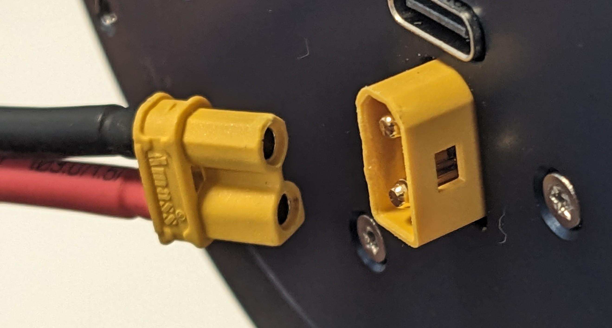

# Electrical Interfaces

## Power Bus

The power bus requirements are:

- Voltage: 48V DC
- Current: up to 30A

Keep in mind that the actuators usually draw much less current (less than 1A without load), but you should still ensure that your power supply can provide the maximum current, or limit the current if the device is demanding more than the power supply can provide.

### Power Bus Cable
The device has an XT30 male connector for power input. The pinout is as follows:

{ width=50% }

To power an actuator you will need a power cable with an XT30 female connector at one end, as shown in the example picture below

{ width=50% }

## USB

Pulsar devices also include a USB connector. 

This allows to connect one actuator directly to a computer via a standard USB-A to USB-C cable.

Such USB interface is intended for configuration, single actuator testing and firmware updates.

## CAN bus

Pulsar devices are compatible with CAN-FD 1Mbit/s|5Mbit/s. 
This is the communication mode currently available to connect and control multiple actuators within a robotic system: all PULSAR HRI devices have dual CAN connectors, so you can daisy-chain them easily. 

An example of CAN bus is depicted in the diagram below, showing CAN bus connection between two daisy-chained Pulsar actuators and a Pulsar CAN to USB adapter, with Termination Resistors (TR) at the two ends of the bus.

### CAN Communication Adapter
A dedicated device is required in order to enable communicating to PULSAR HRI actuators via CAN communication protocol.

Different devices are available on the market to do so, and we provide a CAN to USB adapter, shown below from both sides.

### CAN bus Cables
The cables for realizing the CAN bus connections compatible with PULSAR HRI actuators are characterized by having 3-pin Molex PicoBlade connectors at the two ends.
Such cables are available on the market, and can provided by PULSAR HRI, with an example shown below.

{ width=50% }

Their pinout is as follows:

When purchasing or making one such cable, ensure that the pinout at both ends of teh cable is respected, as indicated below

### CAN bus Termination Resistors (TR)
Industry standard CAN specifications require Termination Resistors (TR)  at both ends of the bus (usually 120 Ohm) to ensure a stable data transmission on the CAN bus. This is particularly important for high-speed communication. 

!!! warning
    Ensure to connect the termination resistors at both ends of the CAN bus to avoid communication issues.

Such TRs simply consist of a 3-way Molex picoblade connector with a 120 Ohm resistor between the CAN-H and CAN_L pins.

These TRs are not usually found on the market: they can be either self-made, or provided by PULSAR HRI, one example shown below. 

{ width=30% }

