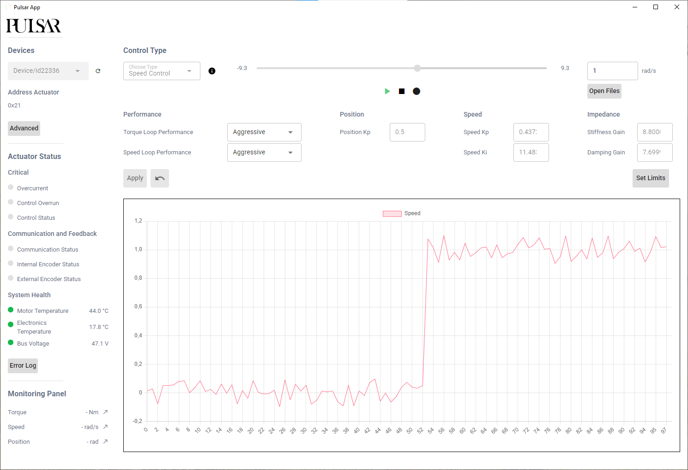

# Pulsar Desktop App

The **Pulsar Desktop App** provides the simplest way to get started with a Pulsar Actuator. It offers a graphical interface (GUI) to configure, control, and monitor the actuator without writing any code.

This tool is ideal for:
- **Quick testing** and tuning actuator parameters
- **Visualizing data** such as position, speed, and torque
- **Running diagnostics** without using scripts

### ⚙️ System Requirements

- **Connection**: The actuator must be **powered** and connected **directly via USB**
- **Compatibility**: Tested on **Windows**  
  > _Linux and macOS support is experimental and currently under review_

At this stage, the app supports controlling **one actuator at a time**.

### 📦 How to Get the App

The app is not yet available as a public download.  
To request an installer, please [contact our team](support.md) and include:
- Your operating system
- Your intended use case (optional)

### 🚀 Key Features

- Browse and connect to available actuators via USB
- Switch between control modes: Speed, Position, Torque, and Impedance
- Change control parameters (e.g., position Kp, torque limits)
- View real-time plots of actuator feedback
- Run basic motion sequences interactively

### 🔍 Learn by Doing

To walk through your first experience with the app, check out the [Quickstart Guide](quickstart.md).  
It covers:
- Powering and connecting your actuator  
- Using the GUI to change control modes and parameters  
- Safety tips for live testing  
- Interacting with the actuator in real-time  

### 🖼 Interface Preview

