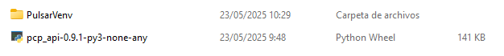

# Getting started
This repository provides all the necessary resources to install the Pulsar API, along with comprehensive documentation and examples to help you get started using the Pulsar Actuator or Motor. It includes detailed descriptions of available classes and methods.
## Installing the Pulsar API into your own Environment
We recommend using a virtual environment to manage dependencies. However, you may also install the package directly into your system’s Python environment if preferred. To create and activate your own virtual environment, follow these steps:
```bash
python -m venv .venv
```
Once created, transfer the generated .whl file to the designated personal directory to proceed with the installation. In this instance, the target distribution is version 0.9.1, specifically pcp_api-0.9.1-py3-none-any.whl





Next, utilize Python’s package manager, pip, to install the package into the active environment. Begin by activating the appropriate virtual environment to ensure the package is installed in the correct context.


=== "Linux"

    ```bash
    source .venv/bin/activate
    ```

=== "Windows"

    ```bash
    .\.venv\Scripts\Activate.ps1
    ```


Now we install the package using pip:

=== "Linux"

    ```bash
    pip install pcp_api-0.9.1-py3-none-any.whl
    ```

=== "Windows"

    ```bash
    pip install pcp_api-0.9.1-py3-none-any.whl
    ```


!!! note "IMPORTANT NOTE"

    This command is installing the version 0.9.1, if you have a newer version modify the name of the file accordingly.


