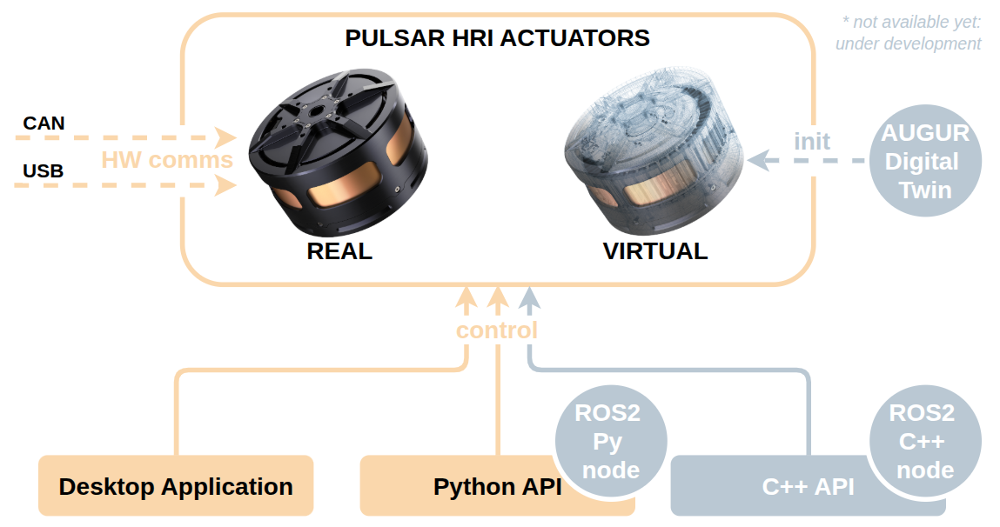

# Home

Welcome to the **PULSAR HRI Ecosystem Documentation**!

Whether you're a researcher, developer, or engineer, the content on this website will help you get up and running with PULSAR products: 
PULSAR HRI develops best-in-class actuation systems and surrounding ecosystem, to enable next-generation robotics.

A question we often hear is: 
>*"How are you different from the other actuator companies?"*

Glad you asked: check out [PULSAR HRI's website](https://pulsarhri.com/technology/) for answers!

### ⚡ First Time Here?

If you can't wait to get hands-on, just go straight to the [**Quickstart No-Code Guide**](quickstart.md) to set up, power your actuator and get moving in minutes!

---
## 🧭 Ecosystem Overview

At a glance, these are the main elements of the ecosystem:

- **REAL** ACTUATORS, which offer the following hardware communication interfaces: 
    - Direct **USB** connection
    - **CAN** communication 
  
- **VIRTUAL** ACTUATORS, closely matching their Real counterparts behaviour thanks to:
    - 🚧 **AUGUR Digital Twin**, UNDER DEVELOPMENT - modeling the physics of the real actuator and running the same control algorithms
  
- **CONTROL INTERFACES** of different kinds and for different needs, to control *both Real and Virtual Actuators*:
    - **Desktop Application**, no-code GUI for single actuator testing, for [quickstart](quickstart.md) and to get familiar with PULSAR HRI actuators and their control
    - [**Python API**](python_api/install_python_api.md), simple but powerful scripting to control multiple actuators for robotics prototypes and to leverage Python libraries such as for **ML, AI** applications
        - 🚧 **ROS2 Python Node**, UNDER DEVELOPMENT
    - 🚧 **C++ API**, UNDER DEVELOPMENT - to control multiple actuators in demanding applications with strict real-time requirements, where latency is a blocker
        - 🚧 **ROS2 C++ Node**, UNDER DEVELOPMENT

!!! note
    A quick alignment on naming we use:
    
    - **Motors** = Direct-drive units without transmission  
    - **Actuators** = Motors with integrated transmission

### 🆘 Need help? 
Visit our [Support page](support.md) or check the [FAQ](faq.md).

---
{ loading=lazy }

