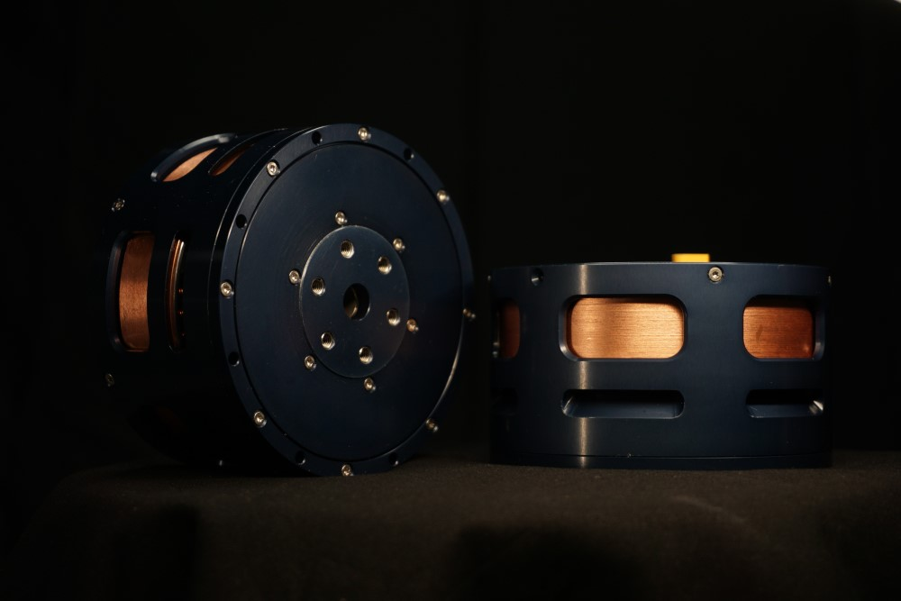
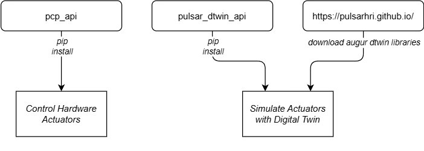

# Home

{ loading=lazy }

Welcome to the **PULSAR HRI Ecosystem Documentation**!

This site contains everything you need to get started with PULSAR HRI actuators, motors, and digital twin tools. Whether you're a researcher, developer, or engineer, this guide will walk you through:

- Connecting and powering on your hardware  
- Controlling actuators via GUI or code  
- Running simulations with our digital twin  
- Understanding supported control modes  
- Integrating with your own systems  

---

## 🚀 First Time Here?

Start with the [Quickstart guide](quickstart.md) to power on your actuator and get moving in minutes!

Curious what makes our motors and actuators unique?  
Check out [Why PULSAR HRI motors and actuators?](why_pulsar.md)

---

## 🧰 What’s Included

- 🛠️ [Setup and Run instructions](quickstart.md) for PULSAR HRI actuators and motors  
- 🖥️ [GUI control via the Desktop App](gui.md)  
- 🐍 [Scripting with the Python API](python_api/install_python_api.md)  
- 🧠 [Simulation with the AUGUR Digital Twin](digital_twin/digital_twin.md)  
- 🎛️ [Overview of supported actuator control modes](control/00-control-modes-overview.md)  

Need help? Visit our [Support page](support.md) or check the [FAQ](faq.md).

---

## 🗺️ Ecosystem Overview

!!! note on naming
    - **Motors** = Direct-drive units without transmission  
    - **Actuators** = Motors with integrated transmission

PULSAR HRI develops best-in-class actuation systems to enable next-generation robotics. Our mission is to push the frontier of performance with:

- ⚡ High **agility**, **torque-density**, and **efficiency**  
- 🧩 Seamless **simulation-to-real** correspondence  
- 🛠️ Full-stack in-house development: motors, transmissions, electronics, and models

To explore our simulation tools, visit the [AUGUR Digital Twin section](digital_twin/digital_twin.md).

