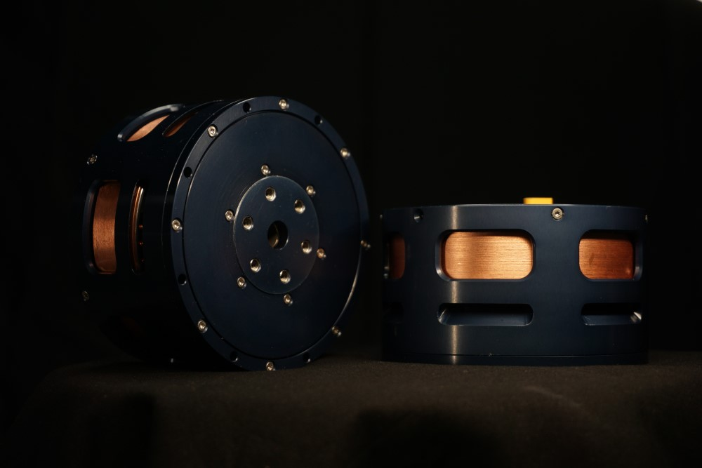

# Home

Welcome to the **PULSAR HRI Ecosystem Documentation**!

Whether you're a researcher, developer, or engineer, the content on this website will help you get up and running with PULSAR products. 
PULSAR HRI develops best-in-class actuation systems and a surrounding ecosystem to enable next-generation robotics.

### ⚡ First Time Here?

If you really can't wait to get hands-on, just go straight to the [**Quickstart No-Code Guide**](quickstarts/quickstart_desktop_app.md) to set up, power your actuator and get moving in minutes!

!!! tip
    Make sure to read the following short section: it will allow you to easily find what you need on the website.

## 🧭 Ecosystem Overview

At a glance, these are the main elements of the PULSAR HRI ecosystem:

  

- **REAL ACTUATORS** which, once [set up](set_up/set_up_real.md), offer the following [hardware communication interfaces](communicate/communicate_real.md): 
    - Direct **USB** connection.
    - **CAN** communication.
  
- **VIRTUAL ACTUATORS** closely matching their real counterparts behavior. These virtual actuators can be set up through:
    - 🚧 [**AUGUR Digital Twin**](set_up/set_up_virtual.md) (*under development*): Models the physics of the real actuator and runs the exact same control algorithms.
  
- **CONTROL INTERFACES** of different kinds and for different needs, used to control both real and virtual actuators:
    - [**Desktop Application**](control/desktop_app/desktop_app.md): A no-code GUI for single-actuator testing, offering [the easiest quickstart experience](quickstarts/quickstart_desktop_app.md) and to get familiar with PULSAR HRI actuators and their control.
    - [**Python API**](control/python_api/install_python_api.md): A simple but powerful way to control multiple actuators in robotics prototypes and to leverage Python libraries such as for **ML** and **AI** applications.
        - 🚧 **ROS2 Python Node** (*under development*).
    - 🚧 **C++ API** (*under development*): Intended to control multiple actuators in demanding applications with strict real-time requirements, where latency is a blocker.
        - 🚧 **ROS2 C++ Node** (*under development*).

!!! note
    A quick alignment on naming we use:
    
    - **Motors** = Direct-drive units without a transmission.
    - **Actuators** = Motors with an integrated transmission.

A question we often hear is: 
>*"How are you different from other actuator companies?"*

Glad you asked. Check out [PULSAR HRI's website](https://pulsarhri.com/technology/) for answers!

---

### 🆘 Need help? 
Visit our [Support page](support.md) or check the [FAQ](faq.md).

---
{ loading=lazy }

