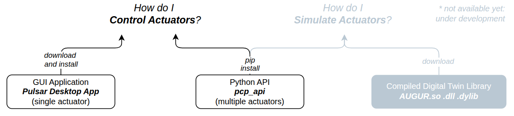

# Home

Welcome to the **PULSAR HRI Ecosystem Documentation**!

Whether you're a researcher, developer, or engineer, the content of this website will help you get up and running with PULSAR products: 
PULSAR HRI develops best-in-class actuation systems and surrounding Ecosystem, to enable next-generation robotics.

I can hear you asking: 
>*"How are you different from the other actuator companies?"*

Well I'm glad you asked: check out our [company website](https://pulsarhri.com/technology/) for answers!

Continue reading to get hands-on! 🚀

---
## 🗺️ Ecosystem Overview

At a high-level glance, this are the main items of the ecosystem:

### ⚡ First Time Here?

Start with the [**Quickstart No-Code Guide**](quickstart.md) to power on your actuator and get moving in minutes!

### 🧰 What Else Can I Find?

- 🐍 [Scripting with the Python API](python_api/install_python_api.md)  
- 🧠 [Simulation with the AUGUR Digital Twin](digital_twin/digital_twin.md)  
- 🎛️ [Overview of supported actuator control modes](control/00-control-modes-overview.md)  

!!! note
    A quick alignment on naming we use:
    
    - **Motors** = Direct-drive units without transmission  
    - **Actuators** = Motors with integrated transmission

### 🆘 Need help? 
Visit our [Support page](support.md) or check the [FAQ](faq.md).

---
{ loading=lazy }

