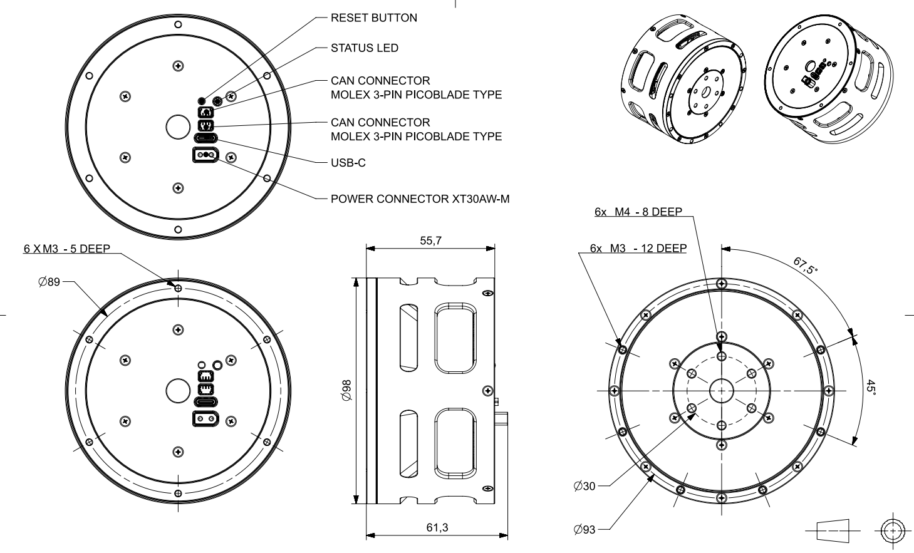

# Mechanical Interfaces

## PULSE98 Actuator

## PULSE115 Actuator
 > coming soon

## 3D Models

Before running a Pulsar Actuator, we recommend attaching it to a generic bracket.

In this way you can get some hands-on understanding on how to best integrate them mechanically and [electrically](electrical_interfaces.md) in your robotics system, and perform some tests safely starting with following the steps in the [Quickstart page](quickstart.md). 

Below we provide some 3D printable files.

| Base | Bracket | Shaft |
|:---:|:---:|:---:|
|  |  |  |
| [Download](assets/3d_models/base.stl) | [Download](assets/3d_models/bracket.stl) | [Download](assets/3d_models/shaft.stl) |
