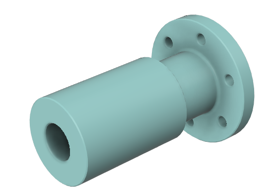
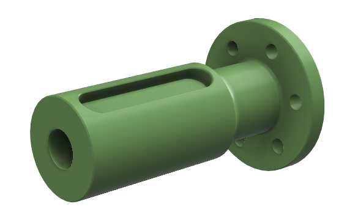

# Mechanical Interfaces

Before integrating the Pulsar Actuator into your system, we recommend attaching it to a generic bracket, so you can familiarize yourself with the usage and perform some tests. We provide some 3D printable files.

| Universal Base | Universal Bracket |
|:---:|:---:|
|  |  |
| [Download](assets/3d_models/base.stl) | [Download](assets/3d_models/bracket.stl) |
| | 2x M6 screws |

| PULSE98 Shaft | PULSE115 Shaft |
|:---:|:---:|
|  |  |
| [Download](assets/3d_models/shaft_PULSE98.stl) | [Download](assets/3d_models/shaft_PULSE115.stl) |
| 2x M6 screws | 2x M6 screws |
