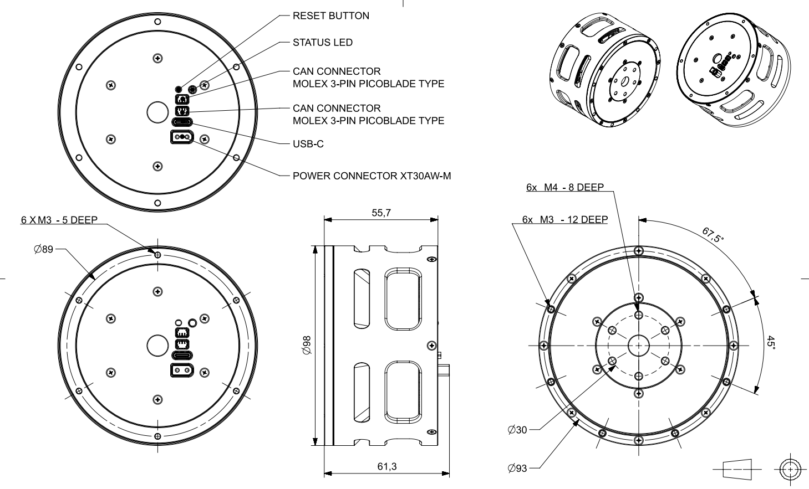
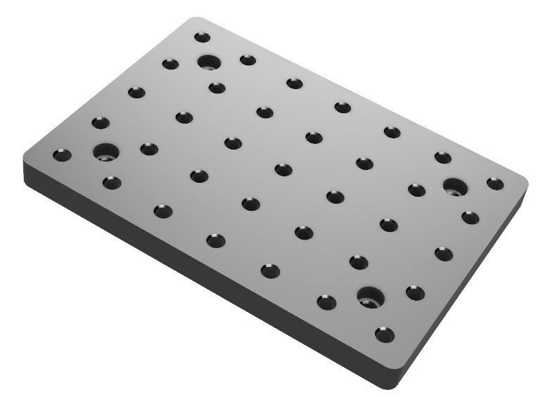
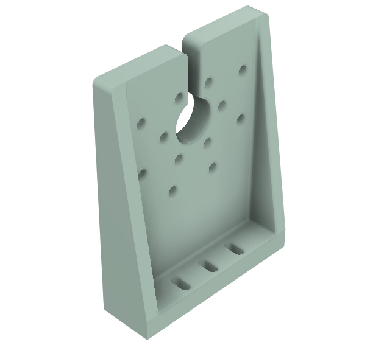
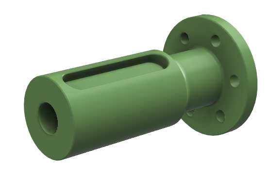

# Mechanical Interfaces

## P98

## 3D Models

Before integrating the Pulsar Actuator into your system, we recommend attaching it to a generic bracket, so you can familiarize yourself with the usage and perform some tests. We provide some 3D printable files.

| Base | Bracket | Shaft |
|:---:|:---:|:---:|
|  |  |  |
| [Download](assets/3d_models/base.stl) | [Download](assets/3d_models/bracket.stl) | [Download](assets/3d_models/shaft.stl) |
