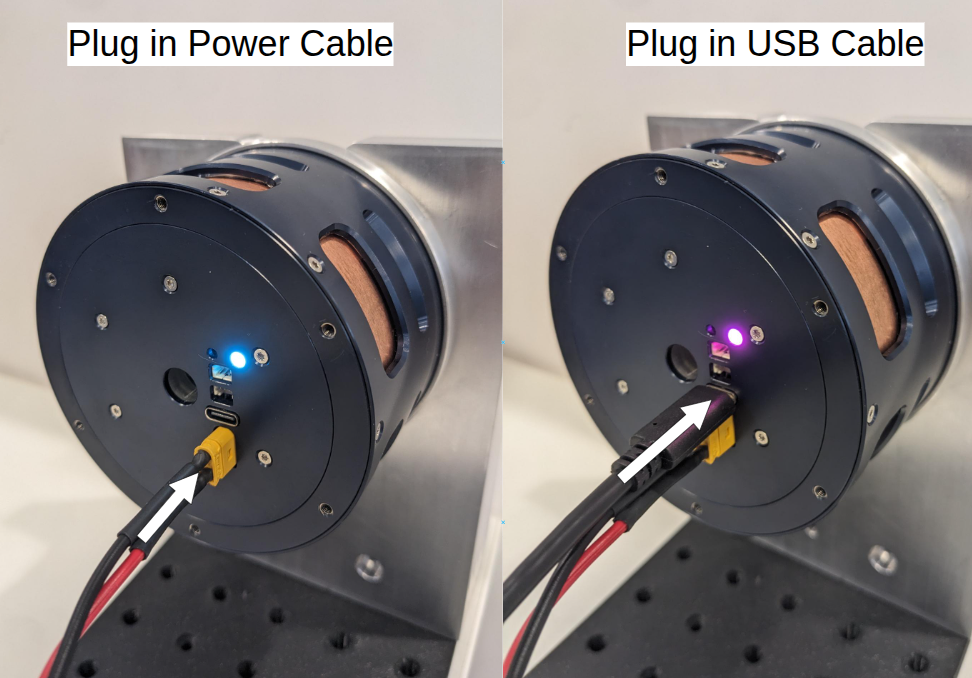
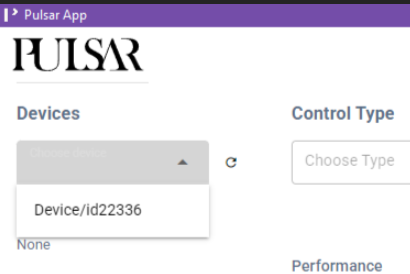
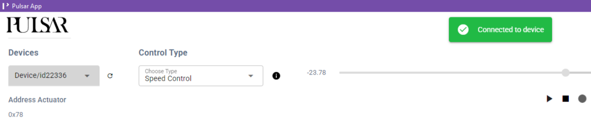
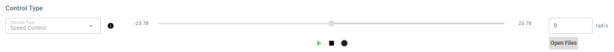
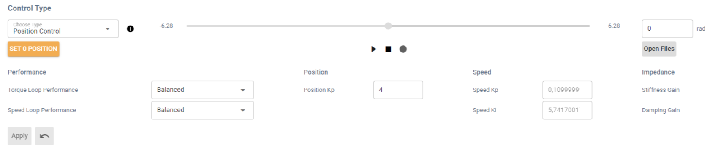
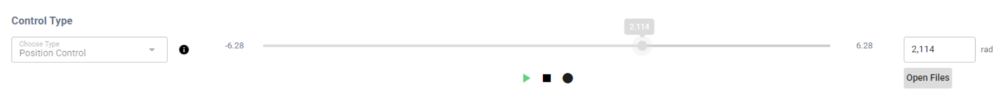

# Quickstart Guide (WIP!!)

This page walks you through the fastest way to get a PULSAR actuator out of the box and running, with direct USB connection.

## 🧰 What You’ll Need

Usually provided by PULSAR HRI:

  - 1x PULSAR HRI **actuator** 
  - 1x **Power Bus Cable** ([more details here](electrical_interfaces.md#Power-Bus-Cable))
  - 1x standard USB-A to **USB-C cable**
  - The [PULSAR Desktop App](gui.md)

Usually NOT provided by PULSAR HRI:

  - A **mechanical support** and **screws** to secure the actuator ([more details and some designs you can 3D-print here](mechanical_interfaces.md))
  - A 48V **Power Supply Unit** ([more details here](electrical_interfaces.md#Power-Bus))
  - A **Computer**  
  
!!! Operating-System-Compatibility
    Currently the ecosystem is mainly compatible with, and tested on Windows and Linux Ubuntu operaing systems

## 🚀 First-Time Setup and Run

1. Connect the the Power Bus Cable to the Power Supply Unit, plug it into the actuator.
2. Activate the Power Supply Unit to power the actuator on, see the [actuator status led](led.md) switch on
3. Plug the USB-C cable into your computer, and then into the actuator USB connector, the [actuator status led](led.md) will change colour

4. Launch the PULSAR Desktop App: you should be able to see the actuator connected via USB in the "Devices" dropdown. Upon selecting it, a popup will inform you of the successful connection and the actuator's address will be shown 
> *the Actuator Address is useful for example to connect via CAN Bus instead of USB, but this will be covered in another guide*

    
    
    !!! warning
        You successfully connected to the actuator, which is now ready to move, that's great!!
        But, as they say, with great power come great responsibilities: 
        **be mindful to keep the actuator's operating area clear of any object** that might get caught or collide with any moving parts.

5. As a first example, we'll run the actuator in **Speed Control** mode: 
    - select **Speed Control** mode under **Control Type**
    - check that the setpoint in rad/s is currently zero
    - hit the **play button**: the actuator won't move as you're telling it to move at zero speed. 
    ==**CROP IMAGE!!**==
    
    - you can now change the setpoint speed either by typing the desired rad/s value in the textbox, or by moving the slider
    - you'll see the actuator moving and the live plot of the position at the bottom of the GUI being updated accordingly

6. We can now move to try **Position Control** mode:
    - select **Positon Control** mode under **Control Type**
    - click on the **SET 0 POSITION** button, this will store the current position (output angle) of the actuator as the zero. 
        - If you skip setting the zero position, it will use the latest zero position that was set and written to memory 
    ==**CROP IMAGE!!**==
    
    - hit the **play button**: the actuator won't move as you're telling it to hold the zero position you just set.
    
    - you can now **change the setpoint position** either by typing the desired rad value in the textbox, or by moving the slider
    - you'll see the actuator moving and the live plot of the position at the bottom of the GUI being updated accordingly

7. You can now try changing the values of **actuator limits** and of the **control parameters** associated to different [available Actuator Control Modes](control/00-control-modes-overview.md)
    - Continuing from teh previous point we can try changing the control parameter associated to Position control, **Position Kp**
        - increasing this parameter essentially makes the actuator more responsive but, if set too high, it will at some point lead to overshooting setpoints and eventually instable behaviour
    !!! warning
        When changing control parameters such as Kp Position, introduce small gradual changes at a time to avoid unexpected and potentially unsafe behaviour of the actuator. For example you can try going from 0.5 to 1 and see how the change impact the behaviour of the actuator, don't go e.g. from 0.5 to 5
    - Upon changing the value of Position Kp, for it to take effect you will need to click the **Apply** button
    - This same process can be applied when selecting other modes, changing their respective control parameters.
        - The **Torque** and the **Speed** control loops also have some preset control parameters that can be simply sleected form the respective dropdown menus
    - You can then try to set some position and torque limts from **Set Limits** and see how that impacts teh behaviour of the actuator.

8. If you have a mechanical shaft that you can attach to the output shaft of the actuator (such as those printable from [here](mechanical_interfaces.md))
    - you could try fastening a shaft to the output of the actuator and try interacting with it in different contorl modes, for example:
        - get the actuator to hold a position setpoint in **Position Control** mode and try to move the output shaft manually: you will feel the actuator opposing your force, the highest the Position Kp, the stronger it will oppose you
        - starting with a low value, e.g. 2Nm, set a torque setpoint in **Torque Control**: the actuator will start spinnging producing such torque at the output: if you grab the output shaft, this will stop as soon as you exert a countertorque of the same amount. You can try changing teh torque setpoint from there or the torque loop control parameters.

## ✅ What's Next?

Well done! You’ve successfully powered on a PULSAR actuator, switched control modes, and observed how it responds. You’ve already covered a lot 🚀

Where can you go from here?

- 🐍 If you’re comfortable with Python and want **deeper control or multi-actuator setups**, continue with [installing the Python API](python_api/install_python_api.md) and try running a few [example scripts](python_api/example_single_actuator.md).
  
- 🧠 If you're interested in **simulating PULSAR actuators** without needing hardware, explore [the AUGUR Digital Twin](digital_twin/digital_twin.md). It mirrors actuator behavior in simulation using the same API.

Need help or something doesn’t work? Head over to the [Support page](support.md): we’ve got your back.
