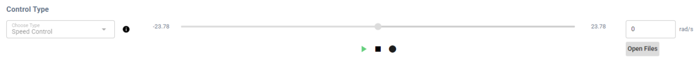
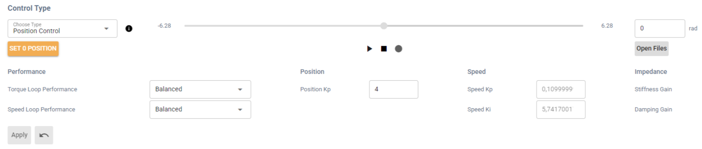
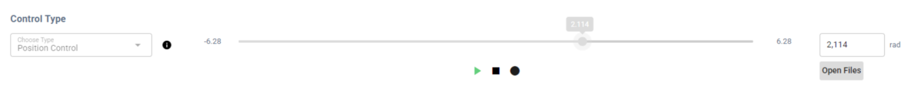

# Quickstart Tutorial: No-Code Desktop App for a Real Actuator via USB

This page walks you through how to run a real actuator connected via USB without writing any code, using the [PULSAR HRI Desktop App](../control/desktop_app/desktop_app.md), which can be downloaded [here](../download/download_app.md).

## 👣 Step-by-Step Guide
1. Make sure your actuator is set up and connected via USB, as described in the [Quickstart Tutorial: Set Up a Real Actuator and Connect via USB](../quickstarts/quickstart_set_up_usb.md).

2. Launch the [PULSAR HRI Desktop App](../control/desktop_app/desktop_app.md). You should see the actuator connected via USB in the **Devices** drop-down menu. When you select it, a pop-up will confirm the connection and display the actuator's address.
> *The actuator address is useful to connect via CAN bus instead of USB.*

  

  

!!! warning
    You have successfully connected to the actuator, which is now ready to move.
    Keep the actuator's operating area clear of any object that might get caught or collide with moving parts.

3. As a first example, run the actuator in **Speed Control** mode:
    - Select **Speed Control** mode under **Control Type**.
    - Check that the setpoint in rad/s is currently zero.
    - Click the **Play** button: The actuator will not move because the speed setpoint is zero.
    
    - You can now change the setpoint speed either by typing the desired rad/s value in the textbox, or by moving the slider.
    - You will see the actuator moving and the live plot of the position at the bottom of the GUI being updated accordingly.

4. Next, try **Position Control** mode::
    - Select **Position Control** mode under **Control Type**.
    - Click the **SET 0 POSITION** button. This stores the current actuator position (output angle) as zero. 
        - If you skip this step, the actuator will use the most recently stored zero position.
        
    - Click the **Play** button: The actuator will not move because you are commanding it to hold the zero position you just set.
    
    - You can now **change the setpoint position** either by typing the desired rad value in the textbox, or by moving the slider.
    - You'll see the actuator moving and the live plot of the position at the bottom of the GUI being updated accordingly.

5. You can now try changing the **actuator limits** and the **control parameters** associated with the different [available actuator control modes](../control/control_modes_explained/control_modes_overview.md).
    - Continuing from the previous step, you can try changing the control parameter associated with **Position Control**: **Position Kp**.
        - Increasing this parameter makes the actuator more responsive, but if it is set too high, it may cause overshoot and eventually unstable behavior.
    !!! warning
        When changing control parameters such as **Position Kp**, make small, gradual adjustments to avoid unexpected and potentially unsafe actuator behavior. For example, try changing the value from 0.5 to 1 first and observe the effect. Do not jump directly from 0.5 to 5.
    - After changing the value of Position Kp, click the **Apply** button for the change to take effect.
    - This same process can be applied when selecting other modes, changing their respective control parameters.
        - The **Torque** and **Speed** control loops also have preset control parameters that can be selected from the respective drop-down menus.
    - You can then set position and torque limits under **Set Limits** and observe how they affect the actuator's behavior.

6. If you have a mechanical shaft that can be attached to the actuator output shaft, such as one of the printable designs available [here](../set_up/hardware_interfaces/mechanical_interfaces.md):
    - You could try fastening a shaft to the output of the actuator and try interacting with it in different control modes, for example:
        - Set the actuator to hold a position setpoint in **Position Control** mode, then try to move the output shaft manually. You will feel the actuator oppose your force. The higher the Position Kp, the stronger that resistance will be.
        - Starting with a low value, for example 2 Nm, set a torque setpoint in **Torque Control** mode. The actuator will start spinning and produce that torque at the output. If you hold the output shaft, it will stop once you apply an equal counter-torque. You can then adjust the torque setpoint or the torque-loop control parameters.

!!! success
    Well done! You have successfully powered on a PULSAR actuator, switched control modes, and observed how it responds. You’ve already covered a lot! 🚀
    
    Where can you go from here?

    - If you’re comfortable with Python and want **deeper control or multi-actuator setups**, continue with the [Quickstart Tutorial: Python API for Real Actuator](../quickstarts/quickstart_python_api.md).
        
    - If you're interested in **simulating PULSAR actuators** without needing hardware, explore [how to create virtual actuators with the AUGUR Digital Twin](../set_up/set_up_virtual.md).

!!! question
    Need help or something doesn’t work? Head over to the [Support page](../support.md): we’ve got your back.
