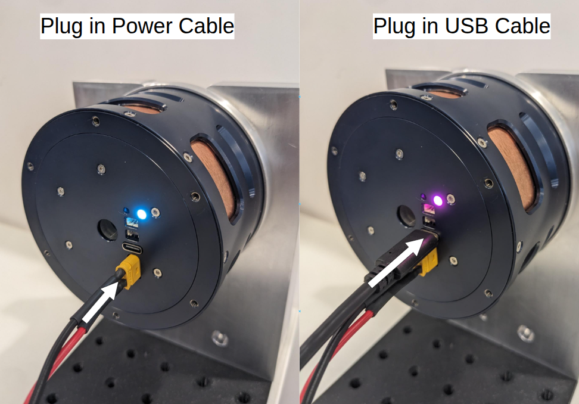

# Quickstart Tutorial: Set Up Real Actuator and Connect via USB
Follow this tutorial for the fastest way to set up a PULSAR actuator out of the box, connected via USB. You will then be able to get it running in no time with the [PULSAR HRI Desktop App](../control/desktop_app/desktop_app.md).

## 🧰 What You’ll Need

Usually provided by PULSAR HRI:

  - 1x PULSAR HRI **actuator** 
  - 1x **Power Bus Cable** ([more details here](../set_up/hardware_interfaces/electrical_interfaces.md#power-bus-cable))
  - 1x standard USB-A to **USB-C cable**

Usually **not** provided by PULSAR HRI:

  - A **mechanical support** and **screws** to secure the actuator ([more details and some 3D-printable designs here](../set_up/hardware_interfaces/mechanical_interfaces.md))
  - A 48 V **Power Supply Unit** ([more details here](../set_up/hardware_interfaces/electrical_interfaces.md#power-bus))
  - A **computer** 
  
!!! Operating-System-Compatibility
    Currently, the ecosystem is mainly compatible with and tested on Windows and Ubuntu Linux.

## 👣 Step-by-Step Guide

1. Connect the Power Bus Cable to the Power Supply Unit, then plug it into the actuator.
2. Turn on the Power Supply Unit to power the actuator. Check that the [actuator status LED](../set_up/hardware_interfaces/led.md) turns on.
3. Plug the USB-C cable into your computer, then connect it to the actuator USB connector. The [actuator status LED](../set_up/hardware_interfaces/led.md) will change color.

!!! success
    Your actuator is now connected! Move to the next [Quickstart Tutorial: No-Code Desktop App for Real Actuator](../quickstarts/quickstart_desktop_app.md) to get it running in minutes!

!!! question
    Need help, or is something not working? Head over to the [Support page](../support.md): we’ve got your back.