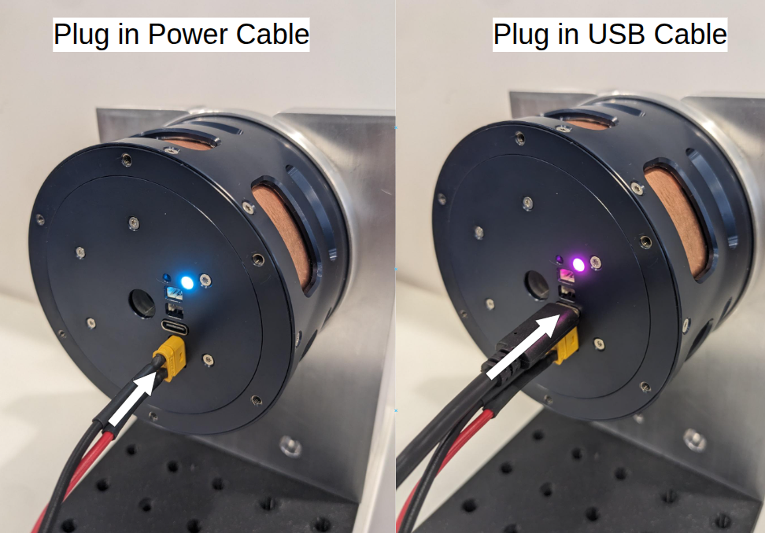

# Quickstart Tutorial: Set up Real Actuator and connect via USB
Follow this tutorial for the fastest way to set up a PULSAR actuator out of the box connected via USB, you will then be able to get it running in no time with the [PULSAR HRI Desktop App](../control/desktop_app/desktop_app.md) next.

## 🧰 What You’ll Need

Usually provided by PULSAR HRI:

  - 1x PULSAR HRI **actuator** 
  - 1x **Power Bus Cable** ([more details here](../set_up/hardware_interfaces/electrical_interfaces.md#power-bus-cable))
  - 1x standard USB-A to **USB-C cable**

Usually NOT provided by PULSAR HRI:

  - A **mechanical support** and **screws** to secure the actuator ([more details and some designs you can 3D-print here](../set_up/hardware_interfaces/mechanical_interfaces.md))
  - A 48V **Power Supply Unit** ([more details here](../set_up/hardware_interfaces/electrical_interfaces.md#power-bus))
  - A **Computer**  
  
!!! Operating-System-Compatibility
    Currently the ecosystem is mainly compatible with, and tested on Windows and Linux Ubuntu operaing systems

## 👣 Step-By-Step Guide

1. Connect the the Power Bus Cable to the Power Supply Unit, plug it into the actuator.
2. Activate the Power Supply Unit to power the actuator on, see the [actuator status led](../set_up/hardware_interfaces/led.md) switch on
3. Plug the USB-C cable into your computer, and then into the actuator USB connector, the [actuator status led](../set_up/hardware_interfaces/led.md) will change colour

!!! success
    Your actuator is now connected! Move to the next [Quickstart Tutorial: No-Code Desktop App for Real Actuator](../quickstarts/quickstart_desktop_app.md) to get it to run in minutes!

!!! question
    Need help or something doesn’t work? Head over to the [Support page](../support.md): we’ve got your back.