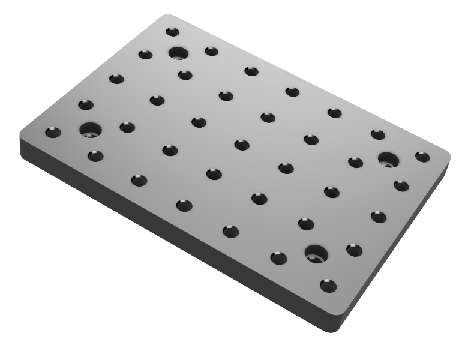
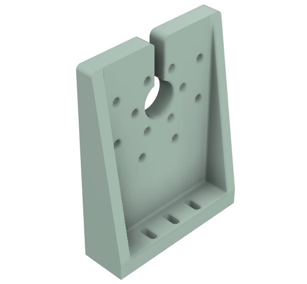
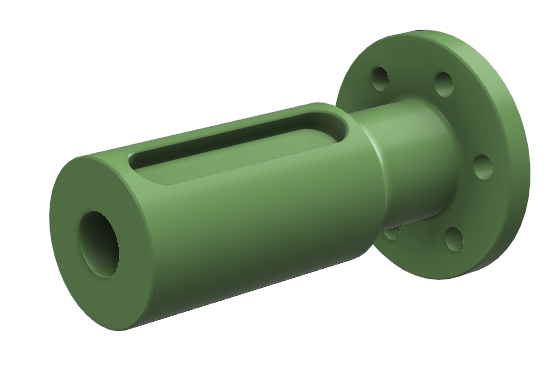

# 3D Models

Before running a Pulsar Actuator, we recommend attaching it to a generic bracket.

In this way you can get some hands-on understanding on how to best integrate them [mechanically](mechanical_interfaces.md) and [electrically](electrical_interfaces.md) in your robotics system, and perform some tests safely starting for example with following the steps in the [no-code quickstart tutorial](../../quickstarts/quickstart_desktop_app.md). 

Below we provide some 3D printable files.

| Base | PULSE115 Bracket | PULSE98 Bracket |
|:---:|:---:|:---:|
|  |  |  |
| [Download](../../assets/3d_models/base.stl) | [Download](../../assets/3d_models/bracket.stl) | [Download](../../assets/3d_models/bracket_pulse98.stl) |
| Shaft |  |  |
|  | | |
| [Download](../../assets/3d_models/shaft.stl) | | |
