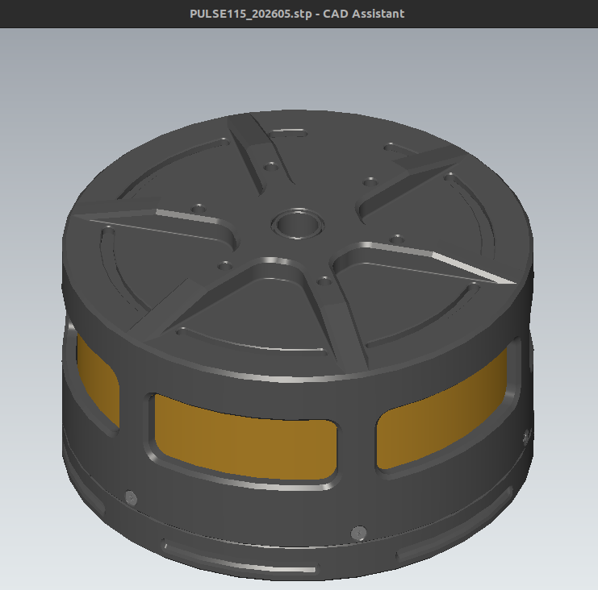

# 3D Models

Before running a PULSAR actuator, we recommend attaching it to a generic bracket.

This lets you test safely while learning how to integrate actuators [mechanically](mechanical_interfaces.md) and [electrically](electrical_interfaces.md) in your robotics system. A good first workflow is the [no-code quickstart tutorial](../../quickstarts/quickstart_pulsar_app.md).

The files below include printable fixtures and public CAD assemblies for integration checks.

## Printable Fixtures

| Base | PULSE115 bracket | PULSE98 bracket |
|:---:|:---:|:---:|
|  |  |  |
| [Download](../../assets/3d_models/base.stl) | [Download](../../assets/3d_models/bracket.stl) | [Download](../../assets/3d_models/bracket_pulse98.stl) |
| Shaft |  |  |
|  | | |
| [Download](../../assets/3d_models/shaft.stl) | | |

## CAD Assemblies

| Model | Preview | Format | Notes | Download |
| --- | --- | --- | --- | --- |
| PULSE115 merged assembly | { width="180" loading=lazy } | STEP | Whole merged assembly for fit checks and mechanical integration planning. | [Download](../../assets/3d_models/PULSE115_202605.stp) |
| PULSE98 merged assembly | _Coming soon_ | STEP | Placeholder for the future public merged assembly. | _Coming soon_ |
