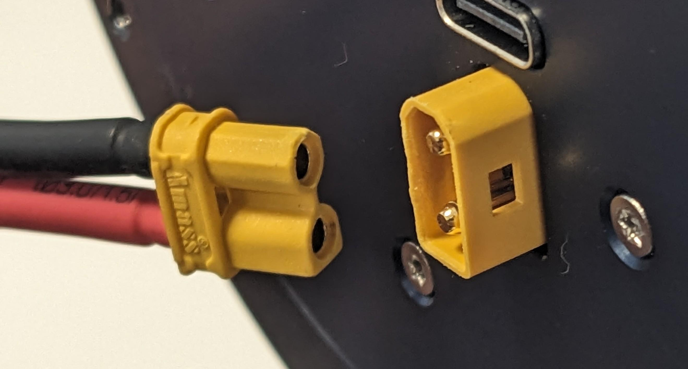
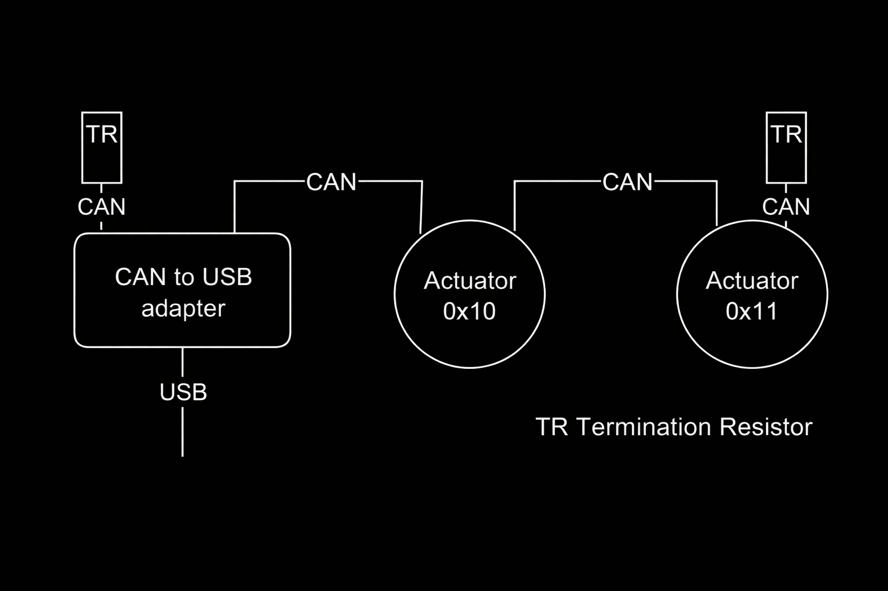
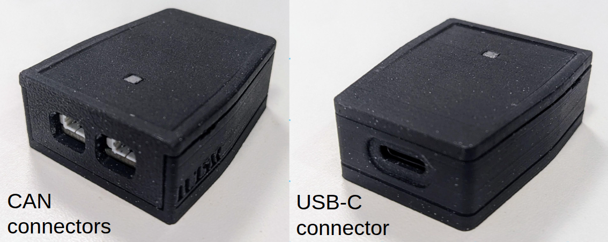
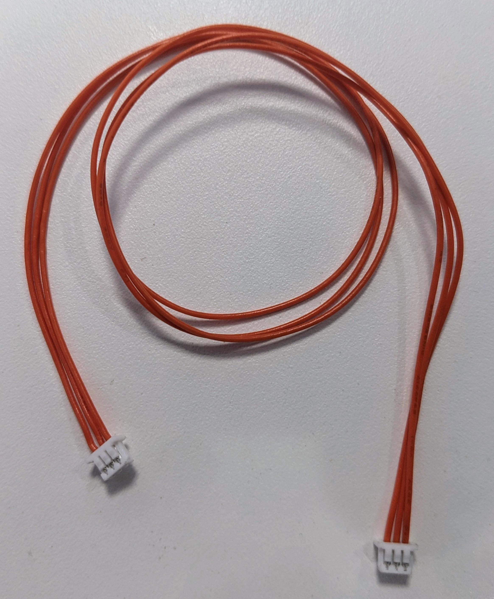
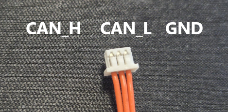
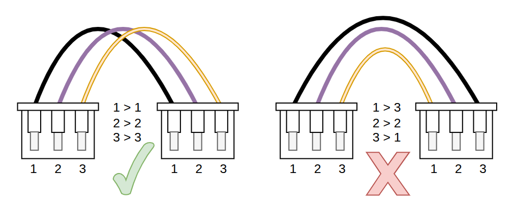
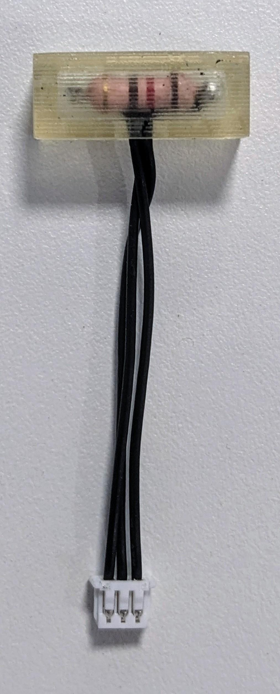

# Electrical Interfaces

## Power Bus

The power bus requirements are:

- Voltage: 48 V DC
- Current: up to 30 A

Keep in mind that the actuators usually draw much less current (less than 1 A without load), but you should still ensure that your power supply can provide the maximum current. Otherwise, limit the current if the device demands more than the power supply can provide.

### Power Bus Cable
The device has an XT30 male connector for power input. The pinout is as follows:

  

To power an actuator, you will need a power cable with an XT30 female connector at one end, as shown in the example image below.

{ width=50% }

## USB

PULSAR devices also include a USB connector. This allows one actuator to be connected directly to a computer via a standard USB-A to USB-C cable. This USB interface is intended for configuration, single actuator testing and firmware updates.

## CAN Bus

PULSAR devices are compatible with CAN-FD 1 Mbit/s | 5 Mbit/s. 
This is the communication mode currently available for connecting and controlling multiple actuators within a robotic system. All PULSAR HRI devices have dual CAN connectors, so they can be daisy-chained easily.

An example of a CAN bus is shown in the diagram below. It shows a CAN bus connection between two daisy-chained PULSAR actuators and a PULSAR CAN-to-USB adapter, with termination resistors (TR) at both ends of the bus.

### CAN Communication Adapter
A dedicated device is required to communicate with PULSAR HRI actuators via the CAN communication protocol.

Different devices are available on the market for this purpose, and we provide a CAN-to-USB adapter, shown below from both sides.

### CAN Bus Cables
The cables used to create CAN bus connections compatible with PULSAR HRI actuators have 3-pin Molex PicoBlade connectors at both ends.

Such cables are available on the market and can also be provided by PULSAR HRI. An example is shown below.

{ width=50% }

Their pinout is as follows:

When purchasing or making such a cable, ensure that the pinout at both ends of the cable is respected, as shown below.

### CAN Bus Termination Resistors (TR)
Industry-standard CAN specifications require termination resistors (TR) at both ends of the bus, usually 120 ohms, to ensure stable data transmission on the CAN bus. This is particularly important for high-speed communication.

!!! warning
    Ensure that termination resistors are connected at both ends of the CAN bus to avoid communication issues.

These TRs consist of a 3-way Molex PicoBlade connector with a 120-ohm resistor between the CAN-H and CAN-L pins.

These TRs are not usually available on the market. They can either be made by the user or provided by PULSAR HRI. An example is shown below.

{ width=30% }

