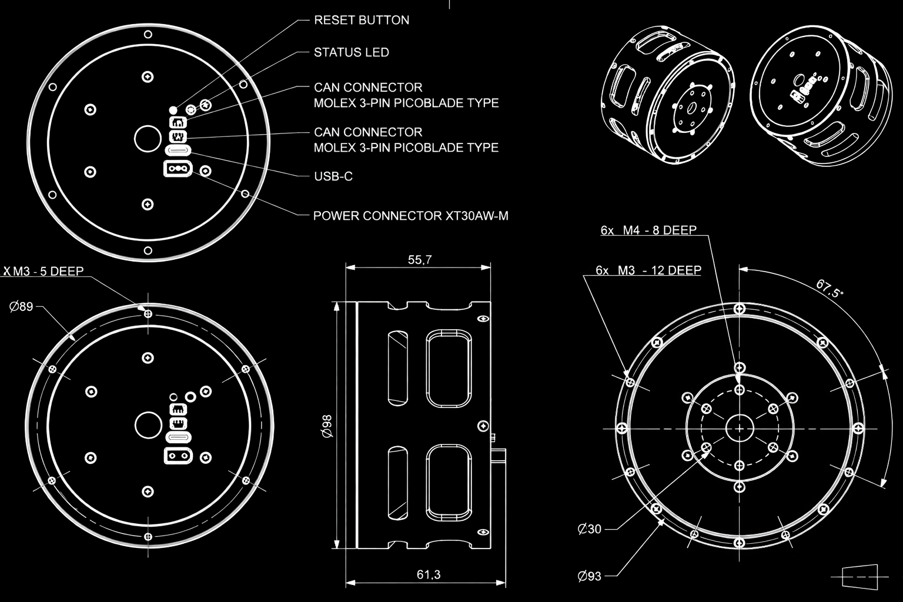

# Mechanical Interfaces

Use this page to check the actuator mounting interfaces before designing brackets, fixtures, or robot integrations.

## PULSE98 Actuator

## PULSE115 Actuator

The PULSE115 mechanical interface drawing is not published yet.

## 3D Models

Printable bracket, base, and shaft models are available on the [3D Models](./3d_models.md) page.
