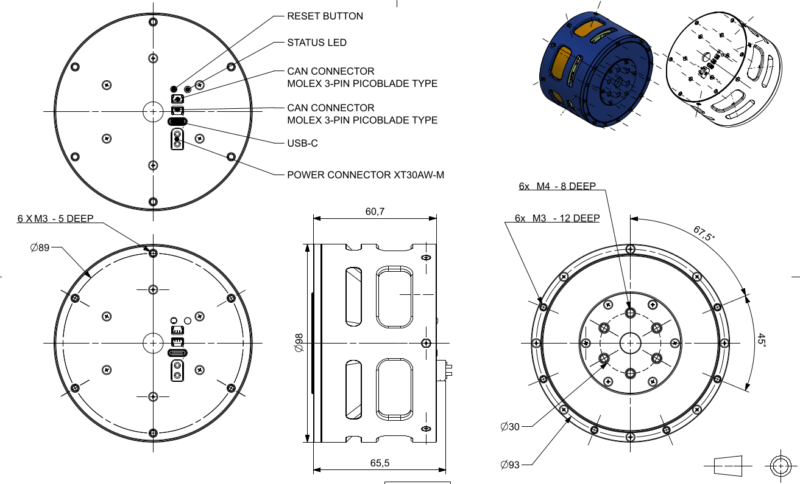
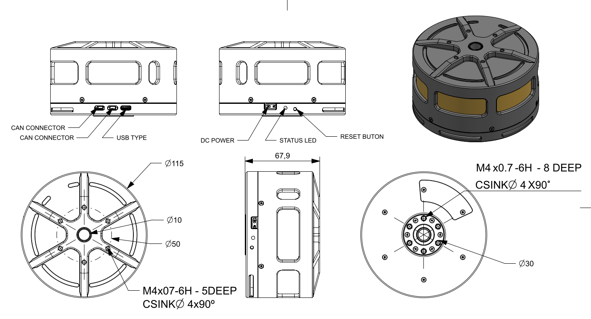

# Mechanical Interfaces

Use this page to check the actuator mounting interfaces before designing brackets, fixtures, or robot integrations.

## PULSE98 Actuator

The PULSE98 public STEP assembly will be added to the [3D Models](./3d_models.md#cad-assemblies) page once available.

## PULSE115 Actuator

A public STEP file of the PULSE115 merged assembly is available on the [3D Models](./3d_models.md#cad-assemblies) page for fit checks and mechanical integration planning.

## 3D Models

Printable bracket, base, shaft, and public assembly files are available on the [3D Models](./3d_models.md) page.
